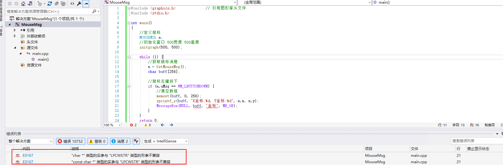

# 什么是逆向分析、逆向分析基础及经典扫雷游戏逆向

先学习什么是逆向分析，然后详细讲解逆向分析的典型应用，接着通过OllyDbg工具逆向分析经典的游戏扫雷，再通过Cheat Engine工具复制内存地址获取，实现一个自动扫雷程序。

## 什么是逆向分析

### 逆向工程

- **反汇编**：一次编译技术，阅读汇编代码 反推出对应的高级代码，比如VC、GCC、Delphi等。

  >反汇编（Disassembly）是将已编译的计算机程序（通常是二进制可执行文件）转换回汇编语言的过程。编译器将源代码翻译成机器代码，而反汇编器则尝试将机器代码翻译回汇编代码，以便程序员或分析人员可以理解、检查和修改程序。
  >
  >在这个过程中，二进制指令（由 CPU 理解的命令）被转换成人类可读的汇编语言指令。虽然汇编代码不如高级编程语言易读且易懂，但它能够为研究者提供有关程序执行方式的关键信息，比如程序执行的逻辑、数据存储和流程控制等。
  >
  >反汇编对于安全分析、逆向工程、调试或检测程序中的漏洞以及研究程序行为等方面非常重要。然而，由于反汇编后的代码可能不如原始源代码易读，因此它通常**用作探索和理解程序的起点，而不是直接修改和编辑程序**。

- **反编译**：通常在C#、Java、.NET框架等，因为它可以直接把元数据还原成高级代码，反编译其实更难，但是对使用的人更简单，比如Android的APK反编译成JAVA源代码。

  >反编译（Decompilation）是将已编译的计算机程序（通常是二进制可执行文件）转换回高级程序设计语言或源代码的过程。与反汇编不同，反编译试图还原程序的高级逻辑结构，将机器码翻译回类似原始源代码的形式，例如 C、C++、或其他高级语言。
  >
  >反编译是一种复杂的过程，因为它需要推断程序的高级结构、变量名、控制流和逻辑，而这些信息在编译时可能被丢失或优化。这意味着反编译产生的源代码可能与原始代码不完全一致，有时甚至可能存在误差或丢失信息。
  >
  >反编译对于软件逆向工程、调试、代码审计和学术研究等领域非常有用。它可以帮助分析程序行为、检测漏洞、或者理解程序的工作原理。然而，和反汇编一样，**反编译得到的代码通常用作探索和理解程序的起点，而不是直接修改和编辑程序。**

反编译和反汇编通常被用于探索、理解和分析程序，而不是直接修改和编辑程序。这是因为：

1. **复杂性和精度：** 反编译和反汇编生成的代码不如原始代码易读，且可能存在误差。修改这些代码可能会引入错误，尤其是对于较大、复杂的程序来说。
2. **失去语义信息：** 在编译过程中，一些语义信息、变量名、注释等可能会丢失，这导致反编译和反汇编后的代码难以理解。
3. **法律和伦理问题：** 在大多数情况下，直接编辑他人的程序可能会涉及法律问题，特别是对于专利、版权和软件许可协议。

因此，反编译和反汇编通常被用于以下目的：

- **程序理解和逆向工程：** 用于了解程序的工作原理、检测漏洞、逆向算法、或者分析软件的行为。
- **调试和研究：** 在分析和调试软件时，反编译和反汇编可以帮助发现问题或者验证猜测。

虽然在一些情况下修改和编辑反编译或反汇编得到的代码是可能的，但这通常需要深入的知识、技能和非常小心的操作，以避免引入错误和问题。

**什么是逆向工程**

简单而言，一切从产品中提取原理及设计信息并应用于再造及改进的行为，都是逆向工程。信息安全中的逆向分析(reverse engineered)更多是通过调查取证和恶意软件包分析等。

逆向分析前提：

- 是什么：样本是什么，良性的还是恶意的
- 干了什么：样本做了哪些事
- 怎么办：知道做了什么才能进行反制，如删除注册表启动项、清理感染的勒索病毒等

### 逆向分析的典型应用

软件逆向有很多实现办法来达到目标，典型的应用包括软件工程、网络安全、司法取证、商业保护等

#### 病毒分析

对于逆向分析，最大的行当是病毒分析，对于安全企业来说病毒分析是主业，主要业务也是根据一些恶意样本的行为给出解决方案(专业查杀、完善引擎、应急响应)。

如WannaCry爆发时立即分析其原因和传播漏洞，分析其影响程度以及给出解决方案。

#### 游戏保护

05年开始随着网游普及和网络虚拟资产(游戏装备)的出现，人们缺乏安全意识的情况下出现了很多恶意程序和病毒，如熊猫烧香：由李俊制作并肆虐网络的一款电脑病毒，是一款拥有自动传播、自动感染硬盘和强大的破坏能力的病毒，它不但能感染系统中的exe、com、pif、src、html、asp等文件，它还能中止大量的反病毒软件进程并且会删除扩展名为gho的系统备份文件。

同时游戏外挂也开始增多，并形成包括私服、生产、破解、DH等功能的生产线，通过分析游戏的关键数据结构，找到关键数据并对数据做修改来达到提升的效果。如吃鸡游戏。通过逆向分析找到每个玩家的坐标位置，可以写一个透视外挂，前提是知道数据以什么形式存在在什么地方，这属于破解外挂，甚至还可以修改攻击里、防御值等、游戏的碰撞检测(两者之间的距离小于某个值)来实现飞天、穿墙等。

正能量的逆向的分析主要是剖析病毒，包括：

- 逆向病毒，获取病毒传播方法，可以遏制病毒的传播
- 逆向病毒，获取病毒隐藏的手段，可以根除病毒
- 逆向分析病毒，获取功能目的，可以溯源攻击者

#### 漏洞挖掘

逆向应用还包括漏洞挖掘和漏洞利用，其中黑客挖掘漏洞的常用方法为：

- 通过分析开源软件的源代码，获取漏洞
- 通过分析产品本身获取漏洞
- 通过分析可以利用漏洞的软件样本
- 通过比较软件前后补丁的差异

大家是否有研究过shellcode、缓冲区溢出？漏洞利用溢出缓冲区，首先要把关键内存、关键代码定位出来，这就属于逆向分析。在漏洞利用过程中，只有越熟悉周围环境则可利用的漏洞就越多，比如逆向服务端，调用shell创建新用户功能，这个时候是没有源代码的，所以需要利用漏洞分析。

逆向分析是信息安全行业的基础技术、必须技术和重要技术，只有功力越深厚，则做的事情就越多。

> 比较补丁

比较补丁前后差异的工具：

 

官方软件在网上有安全更新，关注安全行情和漏洞公告的行当或企业会对比官方的补丁，在拿到官方升级后的软件，他们会对两个流程做比较，其中左边流程多了一个节点，说明升级就是这个位置，再详细分析为什么多了这个检测。注意，官方公告通常会非常简略（补丁号、造成后果、影响范围），比如某个MP3播放器在播放某个冷门格式的音频文件时，会触发一个远程溢出问题，接下来就需要去做逆向分析，下载升级前和升级后的版本做流程对比。

> 电子取证

通过样本追踪地理位置的实例

 

> 无文档学习(反编译或反汇编)

表示没有源码的情况下获取程序信息，称为竞品分析。假设某个公司对同行的产品很感兴趣，想知道为什么它们的算法比我们的好，然后需要去分析和算法还原，这也是逆向分析的主要应用。最好的竞品分析，是能够将算法完美还原，两个代码再次编译后，除了地址不一样其他都一样（IDA查看）。注意，看懂代码完善程序并换另一种程序语言复现，算学习；而如果直接COPY别人的二进制或二进制序列，这算抄袭。

 

## 扫雷游戏逆向分析

### 游戏介绍

通过扫雷游戏进行逆向分析讲解

下载地址：https://github.com/eastmountyxz/Reverse-Engineering-01-Saolei

 

运行外挂：

 

1秒完成(能够判断哪个点是雷)

扫雷中有雷区的定义，作为程序员，定义有雷、没有雷和插旗的状态最好的是使用二维数组来进行存储

在绘制整个游戏区、点击方格的时候都会访问此二维数组

在绘制游戏区时，Windows编程有个关键函数：BeginPaint，该函数为指定窗口进行绘图工作的准备，并将和绘图有关的信息填充到一个PAINTSTRUCT结构中，所以该函数是一个突破口。

### OllyDbg动态分析

使用Ollydbg打开，在逆向分析中，动态分析(Ollydbg)和静态分析(IDA)经常出现，动静结合也是分析的常用手段

参考：

> IDA Pro反汇编工具初识及逆向工程解密实战
>
> OllyDbg动态分析工具基础用法及Crakeme逆向

- **静态分析**：程序并未运行，通过分析文件的结构（格式）获取其内部原理。(反编译)
- **动态分析**：在程序的运行过程中，分析其内部原理。(汇编语句)
- **灰盒分析**：既不静态也不调试，通过一堆监控软件（注册表监控、文件监控、进程监控、敏感API监控）在虚拟机中跑程序，再分析恶意软件的大体行为，并形成病毒分析报告。

不同的分析方式有不同的优点，需要具体问题具体分析。如果是分析扫雷游戏，因为程序没有危害所以可以动态调试分析，但如果是WannaCry蠕虫，就不能在真机上动态分析。同时，很多安全公司为了及时响应各种安全事件，会把样本自动上传到服务器中，它们每天会收到成千上万的恶意样本，但可能存在某些未知样本只上传部分的原因，比如某个未知样本是个动态链接库，此时没有运行条件，只能进行静态分析或者模拟接口分析。

软件静态分析包括分析文件格式、分析网络协议、分析软件日志、修改存档文件等。

 

软件动态调试可以用于HH翻译

 

> 以下使用OllyDbg分析扫雷程序

1. 启动OIlyDbg软件，选择菜单"文件"  打开扫雷程序(winmine.exe)

根据前文分析

>扫雷中有雷区的定义，作为程序员，定义有雷、没有雷和插旗的状态最好的是使用二维数组来进行存储
>
>在绘制整个游戏区、点击方格的时候都会访问此二维数组
>
>在绘制游戏区时，Windows编程有个关键函数：BeginPaint，该函数为指定窗口进行绘图工作的准备，并将和绘图有关的信息填充到一个PAINTSTRUCT结构中，所以该函数是一个突破口。

显示页面时会访问二维数组，并且调用BeginPaint函数来显示界面，接下来尝试查找BeginPaint函数的位置

 

2. 在反汇编窗口右键 “查找”->"当前模块中的名称" 当前没有则查找所有模块中的名称

 

 

在键盘中输入BEGINPAINT即可迅速找到对应的函数BEGINPAINT

 

3. 右键“在每个参考上设置断点” 随后进入断点设置页面

 

双击该断点即可进入反汇编窗口中BeginPaint对应的位置

 

此方法可以定位到函数调用位置

> 名称查找的窗口里右键“反汇编窗口中跟随”

 

或者查看调用树 随后在调用树窗口中ENTER  或双击 或反汇编窗口中跟随


或者名称查找的窗口里右键“数据窗口”

则定位到定义处(定义一段代码  可以通过该定义名称索引到该代码--一句代码可直接见注释部分)   

 

定义处ENTER可以跟随跳转到 user32.BeginPaint(函数或变量的名称)指向的地址 


`jmp dword ptr ds:[<&win32u.NtUserBlockInput>]`这是一条汇编语言中的跳转指令，具体含义取决于上下文和执行环境。

- `jmp`: 是跳转指令，用于无条件跳转到另一个位置执行代码。
- `dword ptr`: 表示跳转目标是一个双字（4字节）的数据。（地址是一个4字节的数据）
- `ds:`: 表示数据段寻址。
- `[<&win32u.NtUserBlockInput>]`: 是内存地址的引用，可能是函数或变量的地址。

在具体的上下文中，`win32u.NtUserBlockInput` 可能是一个函数或变量的名称，而 `jmp dword ptr ds:[<&win32u.NtUserBlockInput>]` 就是将程序的控制流跳转到 `win32u.NtUserBlockInput` 所指向的地址，从而执行相应的代码。

选择该指令后ENTER(跟随)到跳转地址则进入函数代码部分（可以通过win32u.NtUserBlockInput索引到）

 

从而定位到函数代码部分

>名称查找窗口中右键“查找参考”可以查找引用该名称或变量的指令  随后在参考窗口中选择在反汇编窗口中跟随可直接定位到引用部分   
>
>选中引用的指令可以查看该指令的信息窗口 查看该指令的相关信息(名称对应的地址 即 将要跳转到的地址 该地址的指令若还是跳转指令则可以显示在此处 )
>
>进一步跟随或反汇编窗口中跟随数值跳转可以跳转到该名称或变量指向的地址

 

> 名称查找窗口中右键“反汇编窗口中跟随输入函数”  可直接定位到函数代码部分


4. F9 运行程序  看到BeginPaint和EndPaint之前有一个CALL函数

 

该行右键“跟随”之后(或者直接选中该行后ENTER)，去到0x01002AC3位置，发现又存在很多个CALL函数

 

一种分析方法是一个函数一个函数地分析；此处使用另一种分析方法(分析使用的技术后定位猜测点)。

使用此程序时发现程序没有闪烁，猜测使用了`双缓存技术`，双缓存是在缓存中一次性绘制，再把绘制的结果返回在界面上。比如，你要在屏幕上绘制一个圆、正方形、直线，需要调用GDI的显示函数，操作显卡画一个圆，再画一个正方形和直线，它需要访问硬件三次；此时依赖硬件的访问速度，而且如果绘制错误擦除再绘制，需要反复的访问硬件，为了减少硬件操作，我们在内存中把需要绘制的图像准备好，然后一切妥当之后一次性提交给硬件显示。

> 双缓存技术的判断依赖大量逆向分析以及程序开发经验

5. 在反汇编窗口右键鼠标，选择“查找”->“当前模块中的名称”，找到双缓存技术的核心函数BitBlt

BitBlt是将内存中的数据提交到显示器上，该函数对指定的源设备环境区域中的像素进行位块（bit_block）转换，以传送到目标设备环境。

 

点击右键选择“在每个参考上设置断点”，此时绘制了两个断点

 

6. 运行程序到第二个Bitblt断点位置

 

此时显示了两层循环，正好符合二维数组的遍历流程  F8单步步过动态调试可以观察效果

 

可以看到扫雷程序一格一格被渲染(call函数运行完成后完成一个格子的渲染)

每一行被渲染晚成后(内层循环遍历完成)会遍历外层循环

 

7. 在0x01002700位置按下F2取消断点，并在该函数的起始位置0x010026A7设置断点，接下来详细分析这个双缓存函数绘制过程。

  

代码中，ESI首先通过XOR进行清零，然后再加1；接着ESI会调用CMP进行比较，说明ESI是循环变量。

接下来“mov al, byte ptr ds:[ebx+esi]”

>从内存中读取数据到 AL (ax的低8位)寄存器。
>
>- **`mov`：** 汇编语言指令，用于移动数据。
>- **`al`：** 目标寄存器，这里是 8 位累加器寄存器。
>- **`byte ptr`：** 表示要移动的数据大小为 1 字节。后面的地址指向该数据
>- **`ds:[ebx+esi]`：** 是内存地址。这个地址由 DS 寄存器（数据段寄存器）指定的内存段开始，然后以 EBX 和 ESI 寄存器的内容作为偏移量来计算。
>
>因此，这条指令的作用是从内存中的指定地址（由 DS 寄存器指定的内存段，加上 EBX 和 ESI 寄存器的内容计算得出的偏移量）读取一个字节的数据，然后将这个数据加载到 AL 寄存器中。

然后AL判断一个值再做其他的，这有点像访问数据，后面的显示特性随着AL做改动，即AL影响后面显示的内容。

 

>MOV指令是数据传送指令，也是最基本的编程指令，用于将一个数据从源地址传送到目标地址（寄存器间的数据传送本质上也是一样的）。

8. 查看相关寄存器

**EBX（基址寄存器）：** 在内存寻址中常被用作基址。

**ESI （扩展源变址寄存器）：** 用于源地址存放。(这里存放偏移量)

 

猜测EBX基址寄存器和关键数据有关  选择EBX基址寄存器，然后右键选择“数据窗口中跟随”，显示如下图所示的数据。

 

数据窗口显示如下，我们发现“0F”出现较多，猜测"0F"表示无雷  “8F”表示有雷

  

9. 数据区详细解析

取消断点 继续运行程序  弹出扫雷主界面

游戏中通常会存在边界(围墙)  此处猜测10为边界 则0x1005361为起始位置(扫雷程序格子为16*16)

  

猜测“0F”不是雷 “8F”是雷，取消0x01002700位置的断点，然后运行程序弹出扫雷界面，根据二维矩阵进行扫雷

  

点过的地方会变成数字，如“40” “41” "42"

 

点中雷则变为“CC”  其他雷所在位置变为“8A”

 

10. 写个程序进行扫雷数据区详细分析

重新运行程序，选择“查找”->“当前模块中的名称”，找到双缓存技术的核心函数BitBlt，然后重新找一下，找到代码位置(引用Bitblt的指令位置)

 

数据窗口中跟随立即数确定EBX就是雷区的起始位置  此处可以看到ebx的赋值定义

 

随后F7单步调试，执行完0x010026C4赋值语句后在数据窗口中跟随EBX寄存器

 

查看"0x01005360"地址的数据"0F"表示空格  “8F”表示雷  至此确认猜测(验证成功)

11. 编写辅助程序

辅助程序(想办法读出EBX对应的地址里的数据)：程序开启后，鼠标移动到放个上，是雷则提示信息(提示方式很多可以直接显示消息  可以连接外部设备让手表震动等)

> 基本原理知道后，就需要开发解决问题了。对于安全行业来说，不管是做病毒还是研究漏洞利用或游戏防护的，逆向分析都是基础，开发解决问题才是关键。比如，某个病毒样本的行为已经分析清楚了，这个病毒在哪里创建系统文件、修改哪个系统文件、注入到哪个进程、动了哪个注册表等等，逆向分析第一步完成，但更重要的是怎么解决问题，创建注册表就需要删除注册表，修改系统文件就要还原文件。

对于某些病毒资料，有些逆向工程师会给出手工修复方案，比如关闭哪个服务、删除哪个隐藏文件、手工清除注册表哪一项等。但是对于安全公司来说，比如360公司，安全扫描完成之后，不可能弹框提示用户手工修复，而是需要提供自动化方案一键修复，最终结果是需要修改杀毒软件的引擎代码，或者提供专杀工具给用户，这个时候工具需要自动化完成相关操作。

逆向是站在开发基础上，反向推导作者是怎么做的，比如扫雷需要思考作者会用什么方式表示雷区，然后怎么用UI体现出来以及调用什么函数实现。所以，逆向分析之前都要学习开发类的课程，《数据结构》《操作系统》《计算机组成原理》《编译原理》等课程掌握越深入越好。

## 扫雷游戏检测工具

根据扫雷游戏逆向分析确定

- 扫雷的首地址为0x01005360
- 显示“0F”表示空格，显示“8F”表示雷
- 雷区的边界为0x10

> 下面补充一个逆向辅助工具，通过CheatEngine实现雷区检测。

Cheat Engine又称CE修改器，是一款内存修改编辑工具。可以通过Cheat Engine软件来修改游戏中的内存数据、人物属性、金币数值等等，功能强大且操作简单，可以带来良好的更好的体验游戏。

### Cheat Engine确定起始位置

1. 打开Cheat Engine软件，点击“选择打开进程列表”

  

2. 选择扫描类型为“未知的初始数值”，选择“数值类型”为字节，然后点击“首次扫描”

结果为5,230,592

 

3. 点击扫雷程序第一个格子，然后在CheatEngine“扫描类型”中选择“变动的数值”，点击“再次扫描”，此时返回结果14,731个。最终通过反复的以第一个格子的状态为筛选条件找到对应二维数组中的第一个扫雷格子的地址。  

   如果第一个格子是地雷则选择“变动的数值”，点击“再次扫描”后重新开始程序

**这里变动的数值是基于前面扫描过得未知的初始数值来看的**

 

随后继续点击扫雷程序 没出现雷 则继续点击扫雷程序 直到出现地雷

4. 出现地雷则选择“未变动的数值” (前提第一个格子不是雷)点击“再次扫描”

Cheat Engine左边的窗格为对应内存地址的数值改变记录(红色表示此次操作改变了对应地址的数据  Previous表示上次扫描的数值记录)

 

5. 随后继续新一轮的扫雷游戏

重新开始游戏  选择“变动的数值”  点击“再次扫描”

(期间可能多次聚焦扫雷程序都会改变一些地址的数值 但是并没有单击第一个格子  此时就是扫描未变动的数值  因为重新开始游戏时已经扫描过一次变动的数值了  此时第一个格子的状态相比重新开始游戏时的状态没有改变)

 

随后重复进行上面的步骤3~5

**始终以第一个方格的状态为目标进行重复的操作。**

- 1 进入程序后开始扫描：设置“未知的初始数值”(扫描所有数值)
- 2 点击第一个格子后扫描：
- 第一个格子是雷 ，则Cheat Engine设置“变动的数值”后再次扫描(第一个格子相较上次扫描结果 状态改变了)   随后重新开始扫雷程序
- 第一个格子不是雷，Cheat Engine设置“变动的数值”后再次扫描(第一个格子相较上次扫描结果 状态改变了)    随后继续下面的操作
- 3 继续点击扫雷程序，结果非雷， 随后可以直接不断点击扫雷程序直到遇到雷，(每点击一次或一直点击直到遇到雷后)随后Cheat Engine设置“未变动的数值”后再次扫描(第一个格子相较上次扫描结果 状态没改变) 随后重新开始程序
- 4 上面操作碰到了雷后重新开始，扫雷程序重新开始后Cheat Engine设置“变动的数值”再次扫描(第一个格子相较上次扫描结果 状态改变了)
- 5 随后重复2~4的操作  知道将结果筛选的很少 方便定位二维数组首地址为止 始终以第一个方格的状态为目标进行重复的操作

 此方法用来定位二维数组中的第一个扫雷格子状态(对应的的地址的数值)

最后反复筛选得到如下结果

 

 随后可以再次运行程序并开启一个新的扫描 关注0x01005361前后地址的数据变化

最终确定0x01005361地址为二维数组中的第一个扫雷格子对应的的地址  和前面OD软件的分析相同

5. 双击该行移动至底部，然后右键选择“浏览相关内存区域”选项

 

显示内容如下图所示(点击格子前:雷为8F,无雷为0F   点击格子后:如果是雷显示为CC ,不是雷显示为数字 内存里的10表示边界)

  

(从地址0x01005360开始，格子状态的存储以32个字节为单元组，每个格子的状态占一个字节，若某行首边界10所在地址为xxx20，则下一行首边界地址为xx40，尾边界10拼接在格子状态后面  未满32个字节单元组的部分补0F，一直补0F直到下一行首边界10的地址)  所以高宽最宽只能到30 且要符合扫雷逻辑

 

### Cheat Engine确定边界

1. 选择扫雷初级难度

新的扫描  扫描类型为“精确数值” 9 点击首次扫描

 

2. 选择扫雷中级难度

在上次扫描的基础上  选择扫雷中级难度 再次扫描

对应高度为16

 

3. 选择扫雷高级难度 再次扫描

在上次扫描的基础上  选择扫雷高级难度 再次扫描

自定义高度为24

 

最终剩2个结果，高度可能是：

- 0x01005338
- 0x010056A8

4. 同样方法找到宽度

- 0x01005334
- 0x010056AC

 

### C++编写鼠标坐标获取案例

> 首先编写鼠标坐标获取的代码

鼠标坐标通常是(x,y)的形式

1. 创建空项目  名称“MouseMsg”

 

 

2. 为该工程添加一个"main.cpp"文件  并且添加启动项

 

 随后设置为启动项目

 

3. 配置graphics.h文件

graphics.h是一个针对Windows的C语言图形库，分为像素函数、直线和线型函数、多边形函数、填充函数等。在学习C++游戏编程时，通常会发现VS中没有”graphics.h”头文件，因此需要配置

先获取对应的文件：武器库\逆向分析和注入\系统安全和逆向分析\graphic头文件解决方法  对应Include文件中存在两个文件

 

将Include的文件复制到VS安装目录的include文件夹中

 

打开graphic头文件解决方法中的lib2015子文件夹  将内部文件全部复制到VS安装目录的lib文件夹中(注意使用的库easyxw.lib是32位的 不能在x64平台下生成解决方案)

 

由于使用的库是32位的而写的代码目标机器是64位的，会报错产生冲突 Warning Link4272

主要原因就是：第一、平台选择不对。第二、库的版本与平台对应不上。第三、选的库的类型（X86、X64）的区别。

 

这里改为x86(平台选择win32即可)

 

随后即可在VS中添加graphics.h添加头文件 该图形库有丰富的绘图函数可以使用

```clike
#include <graphics.h>              // 引用图形库头文件
#include <conio.h>

int main()
{
	initgraph(640, 480);            // 创建绘图窗口，大小为 640x480 像素
	setlinecolor(RGB(255, 0, 0));   // 设置当前线条颜色 红色
	setfillcolor(RGB(0, 255, 0));   // 设置当前填充颜色 绿色
	fillcircle(200, 200, 100);      // 画圆，圆心(200, 200)，半径 100
	_getch();                       // 按任意键继续
	closegraph();                   // 关闭图形环境
}
```

由于前面生成了x64平台的解决方案 且报错了  这里清理一下解决方案再重新生成x86的解决方案

 

 

 

easyxw.lib可能有报错  这里忽略

4. 编写鼠标事件代码

```clike
#include <graphics.h>              // 引用图形库头文件
#include <stdio.h>

int main()
{	
	//定义鼠标
	MOUSEMSG m;
	//初始化窗口 500宽度 500高度
	initgraph(500, 500);

	while (1) {
		//获取鼠标消息
		m = GetMouseMsg();
		char buff[256];

		//鼠标左键按下
		if (m.uMsg == WM_LBUTTONDOWN) {
			//清空数组
			memset(buff, 0, 256);
			sprintf_s(buff, "X坐标:%d, Y坐标:%d", m.x, m.y);
			MessageBox(NULL, buff, "坐标", MB_OK);
		}
	}
	return 0;
}
```

"const char *” 类型的实参与 “LPCTSTR” 类型的形参不兼容 

 

解决方法：

 

> [VC++ 2019 “const char*“类型的实参与“LPCTSTR“类型的形参不兼容，的解决办法_严重性 代码 说明 项目 文件 行 禁止显示状态 错误(活动) e0167 "const char _一笑的博客-CSDN博客](https://blog.csdn.net/yixiao0307/article/details/119709713)
>
> [const char*类型的实参与LPCTSTR类型的形参不兼容_const char lpctstr是什么类型-CSDN博客](https://blog.csdn.net/qq_21210467/article/details/86632327)

生成解决方案  运行如下所示  点击鼠标可以看到对应的鼠标位置

 

GetMouseMsg函数表示获取鼠标消息，通过Spy++可以看到很多Windows系统自带的鼠标操作、键盘操作、消息操作等(日志消息->消息选项可以选择要查看的消息)

 

可以获取鼠标是左键还是右键按下 以及对应坐标

  

### C++编写自动扫雷程序

通过C++实现一键扫雷功能

模拟鼠标在雷区的点击操作，并且按下所有非雷区域从而实现一键扫雷

Windows应用程序的消息机制，通过SendMessage函数向指定窗口发送消息，也就是在获取到扫雷的窗口句柄后，利用这个函数向该窗口发送鼠标按键消息，从而实现模拟鼠标的操作。

>[逆向工程第007篇：扫雷辅助的研究——0秒实现一键自动扫雷 (csdn.net)](https://blog.csdn.net/ioio_jy/article/details/90577172)

1. 创建应用程序“SaoleiHelp”  并添加主函数

 

 添加主函数

 

2. 分析扫雷程序的区域及坐标定义

坐标基于客户区左上角 客户区定义：

 

如果A点为坐标原点，那么第一块雷区的坐标就应为（AC,CE），如果B点为坐标原点，那么第一块雷区的坐标就应为（BD,DE）。经过实际测试，MSDN中所谓的客户区，其实是以B点作为起点的位置，即原点B坐标（0,0），雷区中心即E点的坐标为（16,61），每个雷区小方块的大小为16×16，于是可以知道，这里需要循环计算出雷区每一个小方块的坐标，这个坐标与保存有雷区的二维数组下标紧密相关。

假设二维数组是`mine[y1][x1]`，其中y1表示的是雷区有多少行，x1表示雷区的列数，那么每个雷区方块的坐标为：

```c
x = x1 * 16 + 16;
y = y1 * 16 + 61;
```

获得坐标后模拟鼠标点击操作

```clike
SendMessage(hWnd, WM_LBUTTONDOWN, MK_LBUTTON, MAKELONG(x, y));
SendMessage(hWnd, WM_LBUTTONUP, MK_LBUTTON, MAKELONG(x, y));
```

3. 分析扫雷游戏的雷区长度

结合Cheat Engine确定的雷数目  雷区宽度  雷区高度

- 雷数：0x01005330
- 宽度：0x01005334
- 高度：0x01005338

 

通过动态分析已经确定雷区格子状态信息：

- “8F”表示地雷
- “8E”表示旗子
- “40”表示空格
- “41”到“49”表示数字1~9
- “10”表示边界
- “0F”用来隔一行
- “8A” 最后显示的地雷结果
- “CC”点中格子为地雷时的对应格子值

 

以及关键地址 雷区分布的起始地址：0x01005361

计算含有边界的情况，雷区分布情况为：

- 起始地址：0x01005340
- 结束地址：0x0100567F

完整代码：

```clike
#include <stdio.h>
#include <windows.h>
#include <graphics.h>

int main() {
	DWORD Pid = 0;
	HANDLE hProcess = 0;

	DWORD result1, result2;

	// 获取扫雷游戏对应的窗口句柄
	HWND hWnd = FindWindow(NULL, L"扫雷");
	if (hWnd != 0) {
		// 获取扫雷进程ID
		GetWindowThreadProcessId(hWnd, &Pid);
		// 打开扫雷游戏获取其句柄
		hProcess = OpenProcess(PROCESS_ALL_ACCESS, FALSE, Pid);
		if (hProcess == 0) {
			printf("Open winmine process failed.");
			return 0;
		}

		// 存放雷区的起始地址
		DWORD dwBoomAddr = 0x01005340;

		// 雷区的最大值（包含边界）
		DWORD dwSize = 832;
		PBYTE pByte = NULL;
		pByte = (PBYTE)malloc(dwSize);

		// 读取整个雷区的数据
		ReadProcessMemory(hProcess, (LPVOID)dwBoomAddr, pByte, dwSize, 0);
		int i = 0;
		int j = 0;
		int n = dwSize;

		// 读取雷区的长和宽
		DWORD dwInfo = 0x01005330;
		DWORD dwHeight = 0, dwWidth = 0;
		ReadProcessMemory(hProcess, (LPVOID)(dwInfo + 4), &dwWidth, sizeof(DWORD), 0);    //宽度
		ReadProcessMemory(hProcess, (LPVOID)(dwInfo + 8), &dwHeight, sizeof(DWORD), 0);   //高度

		int h = dwHeight;
		int count = 0;

		// 雷区转换，去掉雷区多余的数据
		PBYTE pTmpByte = NULL;
		pTmpByte = (PBYTE)malloc(dwHeight * dwWidth);
		while (i < dwSize) {
			//边界判断
			if (pByte[i] == 0x10 && pByte[i + 1] == 0x10) {
				i = i + dwWidth + 2;
				continue;
			}
			else if (pByte[i] == 0x10) {
				for (j = 1; j <= dwWidth; j++) {
					pTmpByte[count] = pByte[i + j];
					count++;
				}
				i = i + dwWidth + 2;
				continue;
				h--;
				if (h == 0) break;
			}
			i++;
		}

		// 获取雷区方块的坐标，然后模拟鼠标进行点击
		int x1 = 0, y1 = 0;
		int x = 0, y = 0;
		for (i = 0; i < dwHeight * dwWidth; i++) {
			if (pTmpByte[i] != 0x8F) { //雷
				x1 = i % dwWidth; //确定第几列
				y1 = i / dwWidth; //确定第几行
				x = x1 * 16 + 16;
				y = y1 * 16 + 61;
				SendMessage(hWnd, WM_LBUTTONDOWN, MK_LBUTTON, MAKELONG(x, y));   //鼠标按下
				SendMessage(hWnd, WM_LBUTTONUP, MK_LBUTTON, MAKELONG(x, y));     //鼠标抬起
			}
		}

		free(pByte);
		CloseHandle(hProcess);
	}
	else {
		printf("Get hWnd failed.");
	}
	return 0;
}
```

```clike
		int i = dwWidth + 2;
		int j = 0;
		int h = dwHeight;
		int count = 0;
		PBYTE pTmpByte = NULL;
		pTmpByte = (PBYTE)malloc(dwHeight*dwWidth);
 
		while (i < dwSize) {
			if (pByte[i] == 0x10) {
				for (j = 1; j <= dwWidth; j++) {
						pTmpByte[count] = pByte[i + j];
						count++;
				}
				i = i + dwWidth + 1;
				h--;
				if (h == 0) break;
			}
			i++;
		}
```

运行如下：

 

 


## 参考

- [科锐逆向的钱林松老师受华中科技大学邀请- “逆向分析计算引导”](https://www.bilibili.com/video/BV1J5411x7qz?p=1)
- [c++学习笔记——VS2015中添加graphics.h头文件 - 行歌er](https://blog.csdn.net/weixin_41695564/article/details/81279660)
- [逆向工程第007篇：扫雷辅助的研究——0秒实现一键自动扫雷](https://blog.csdn.net/ioio_jy/article/details/90577172)
- https://www.bilibili.com/video/BV18W411U7NH
- [[网络安全自学篇\] 五.IDA Pro反汇编工具初识及逆向工程解密实战](https://blog.csdn.net/Eastmount/article/details/98789742)
